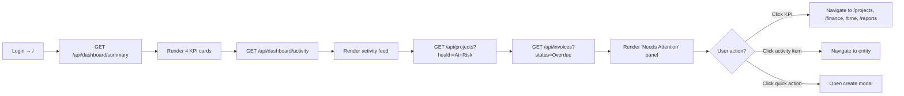
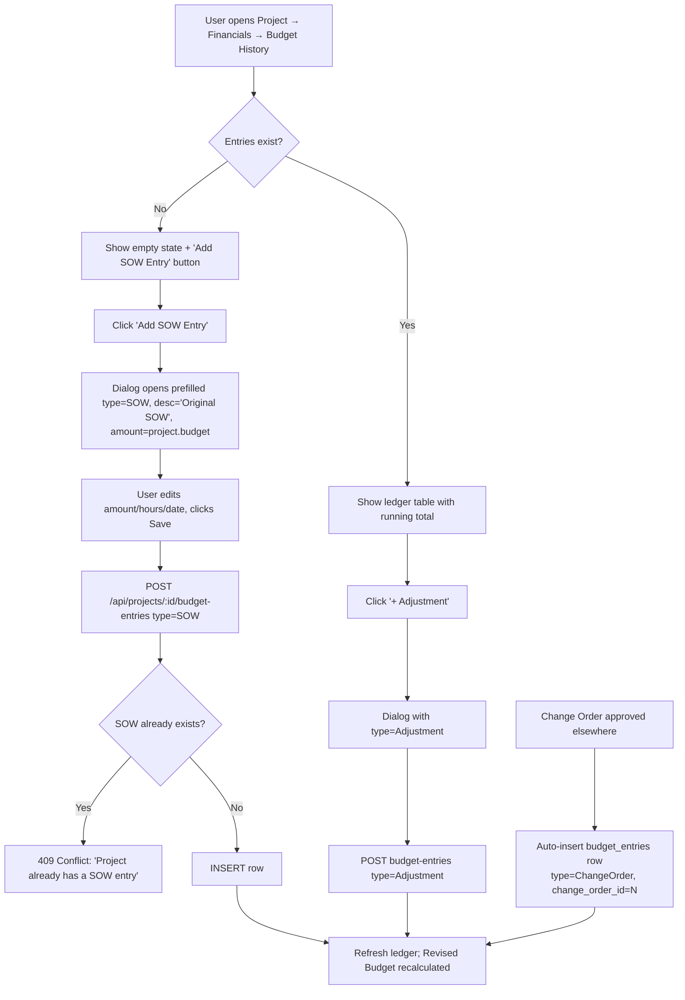
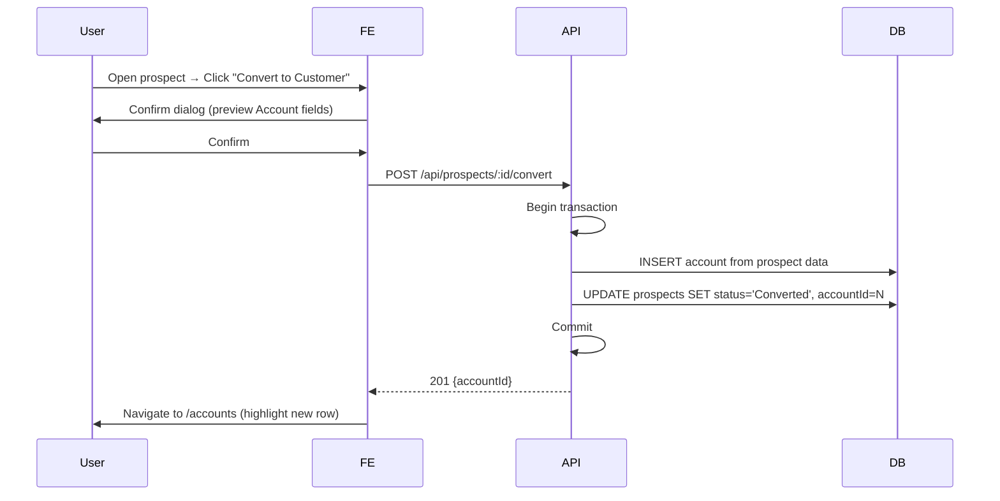
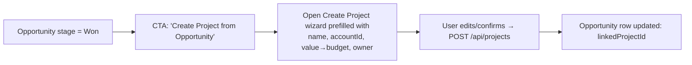
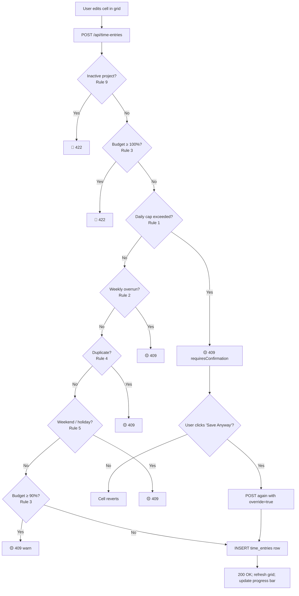
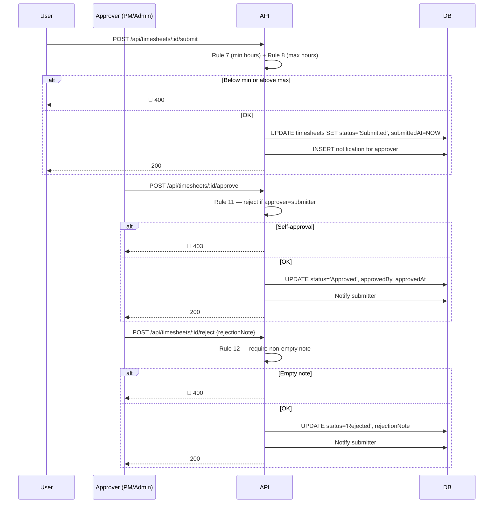
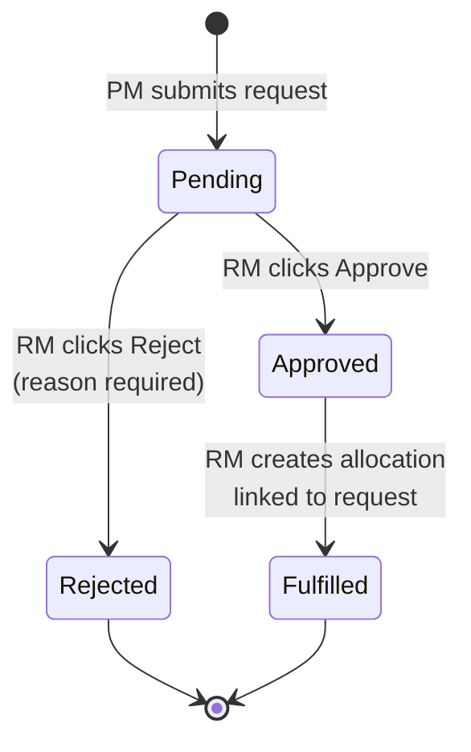
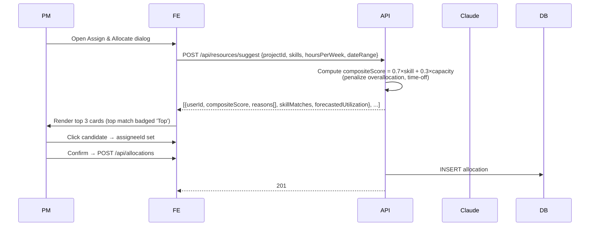
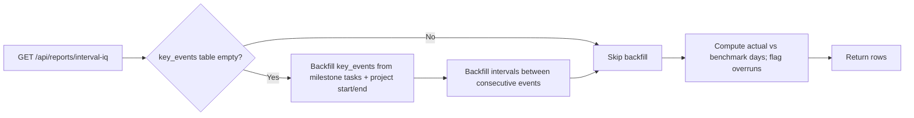

# BusinessNow PSA — Module-wise Business Requirements Document (BRD)

**Product:** BusinessNow Professional Services Automation (PSA) Platform
**Owner:** KSAP Technology Consulting
**Document version:** 1.0
**Last updated:** May 7, 2026
**Status:** Baselined for in-flight product

---

## 1. Executive summary

BusinessNow PSA is a full-stack, multi-module platform that runs the entire delivery lifecycle for a professional-services firm — from sales prospecting through opportunity conversion, project delivery, time tracking, resource staffing, billing, revenue recognition, customer satisfaction, and reporting.

The platform is organized into 13 first-class modules (Dashboard, Projects, Accounts, Prospects, Opportunities, Time Tracking, Resources, Finance, Reports, Admin, Notifications, CSAT, Command Center) backed by an Express + PostgreSQL API and a React + Vite single-page web app. It enforces a four-role RBAC model (`account_admin`, `super_user`, `collaborator`, `customer`) and serves both internal staff and external customers through the same UI shell with permission-driven views.

This BRD is organized module-by-module. Each module section follows a consistent structure:

1. Purpose & scope
2. Primary actors & permitted roles
3. End-to-end user flows (use cases)
4. Process flow (happy path + edge cases)
5. Screens, fields, and validations
6. System interactions & dependencies
7. Business rules & constraints

Cross-cutting concerns (auth, RBAC, integrations, non-functional requirements, glossary) are covered in §3 and §17.

---

## 2. Document conventions

| Convention | Meaning |
|---|---|
| **MUST** / **SHALL** | Mandatory requirement |
| **SHOULD** | Recommended; deviation requires justification |
| **MAY** | Optional |
| `code` | API path, field name, DB column, or code identifier |
| 🟢 Happy path | Default success branch |
| 🟡 Soft-block | User can override with confirmation dialog |
| 🔴 Hard-block | User cannot proceed; must change input or escalate |
| ⚠️ | Edge case |

All process flows below use Mermaid syntax (renders natively on GitHub, GitLab, and most Markdown viewers).

---

## 3. System overview

### 3.1 Architecture

```
┌──────────────────┐    HTTPS    ┌──────────────────────┐    SQL    ┌────────────────┐
│  React + Vite    │ ──────────► │  Express 5 API        │ ────────► │  PostgreSQL    │
│  SPA (port 5000) │             │  (port 8080, /api/*)  │           │  (Drizzle ORM) │
└──────────────────┘             └──────────┬───────────┘           └────────────────┘
                                             │
                                             ▼
                                   ┌──────────────────┐
                                   │  Anthropic Claude │  (AI assistance)
                                   │  via Replit Integ.│
                                   └──────────────────┘
```

### 3.2 Tech stack

- **Frontend:** React 18, Vite, Wouter (routing), TanStack Query, shadcn/ui, Tailwind CSS, Recharts, DM Sans
- **Backend:** Node.js 20, Express 5, Drizzle ORM, Zod validation, Pino logging
- **Database:** PostgreSQL 16 (65 tables, see schema reference in §17.3)
- **API contract:** OpenAPI 3.1 → Orval codegen → typed React Query hooks + Zod schemas
- **AI:** Anthropic Claude (Sonnet) via Replit AI Integration (`AI_INTEGRATIONS_ANTHROPIC_*` env vars)

### 3.3 Authentication transport

- Auth is **trust-based** in the current build: a demo "Pick a user" login screen sets `userId` and `role` in browser `localStorage`.
- Every API request carries two HTTP headers: `x-user-id: <integer>` and `x-user-role: <canonical role>`.
- The API server validates the role value, applies RBAC at the route level, and uses the user ID for ownership checks.
- A real session layer (login form, JWT/cookie session, MFA) is **out of scope** for this release and is documented as a known constraint (§17.2).

### 3.4 Roles & permissions matrix (canonical)

| Role | Level | Purpose | Can do |
|---|---|---|---|
| `account_admin` | 4 | Workspace owner | Everything: user mgmt, cost rates, company settings, all CRUD across modules |
| `super_user` | 3 | PM / Finance / Senior IC | All project, time, finance, reports operations except cost-rate edit and core admin |
| `collaborator` | 2 | Internal IC | Log own time, view assigned projects/tasks; no project create, no admin |
| `customer` | 1 | External portal user | Read-only access to projects they're scoped to; submit CSAT |

Legacy role values (`Admin`, `PM`, `Finance`, `Developer`, etc.) are normalized into the canonical four via `LEGACY_ROLE_MAP` (`artifacts/api-server/src/constants/roles.ts`). Permission keys live in `ACCOUNT_PERMISSIONS` (58 keys) and `PROJECT_PERMISSIONS` (34 keys); `can(role, perm)` and `requirePermission(perm)` are the enforcement primitives.

---

## 4. Module — Dashboard

### 4.1 Purpose & scope
Single landing page that summarizes the workspace at a glance: KPIs, activity feed, items needing attention, quick actions, and (for admins on first-run) an onboarding checklist.

### 4.2 Primary actors
All authenticated roles. View is identical for `super_user` and `account_admin`; `collaborator` and `customer` see a slimmer version (KPIs scoped to their projects).

### 4.3 Use cases

| ID | Use case | Primary actor |
|---|---|---|
| DSH-01 | View workspace KPIs (active projects, revenue MTD, hours logged, utilization) | All |
| DSH-02 | Drill into a KPI to its source page | All |
| DSH-03 | Review recent activity (project, time, invoice events) | All |
| DSH-04 | Triage "Needs Attention" items (at-risk projects, overdue invoices) | super_user, account_admin |
| DSH-05 | Launch a quick action (Create Project, Log Time, New Invoice) | super_user, account_admin |
| DSH-06 | Complete or dismiss the onboarding checklist | account_admin (first run only) |

### 4.4 Process flow — happy path



### 4.5 Edge cases
- ⚠️ Empty workspace (no projects): KPI cards render zeros; "Needs Attention" shows empty state with "Create your first project" CTA.
- ⚠️ API failure: each card shows skeleton → error toast (global handler in `lib/queryClient.ts`); other cards continue to load.
- ⚠️ `account_admin` who has dismissed the checklist (`users.onboardingDismissed = true`): checklist hidden permanently for that user.

### 4.6 Screen — Dashboard (`/`)

| Section | Component | Source data |
|---|---|---|
| Page header | `<h1>Dashboard</h1>` | static |
| KPI cards (4) | clickable cards | `GET /api/dashboard/summary` |
| Onboarding checklist | `<OnboardingChecklist />` (admin-only, dismissable) | derived from users/projects/allocations/timesheets |
| Activity feed | scroll list, last 20 items | `GET /api/dashboard/activity` |
| Needs Attention | two panels: at-risk projects + overdue invoices | `GET /api/projects?health=At+Risk`, `GET /api/invoices?status=Overdue` |
| Quick actions | 3 buttons | static — open create dialogs |

### 4.7 Field-level details

| Field | Type | Validation | Behavior |
|---|---|---|---|
| KPI card target | URL | hardcoded route | Wouter navigate |
| Activity item timestamp | ISO date | server-supplied | `formatDistanceToNow` (date-fns) |
| At-risk threshold | derived | `project.health IN ('At Risk', 'Off Track')` | server-side filter |
| Overdue invoice threshold | derived | `invoice.dueDate < TODAY AND status != 'Paid'` | server-side filter |

### 4.8 Dependencies
- Backend: `routes/dashboard.ts`, `routes/projects.ts`, `routes/invoices.ts`, `routes/users.ts`
- Frontend: TanStack Query, navigation via Wouter

### 4.9 Business rules
- Revenue MTD aggregates **paid + approved** invoice amounts only; draft invoices are excluded.
- Utilization = `SUM(billable hours) / SUM(capacity hours)` for the current week, across all internal users.
- Activity feed is **read-only**; clicking navigates but does not mutate.

---

## 5. Module — Projects

### 5.1 Purpose & scope
Central delivery workspace. Each project has tasks (with hierarchy via `isPhase`), allocations, financials (budget, change orders, SOW), documents, updates, change orders, CSAT surveys, and lifecycle states.

### 5.2 Primary actors

| Action | Required role / permission |
|---|---|
| View project list | Any authenticated; results filtered by project membership for `collaborator` and `customer` |
| Create project | `super_user` or `account_admin` (`projects.create`) |
| Edit project (status, health, budget) | `super_user` (PM on the project) or `account_admin` (`projects.update`) |
| Archive / restore project | `account_admin` only |
| Add task / phase | `super_user` (PM on project) or `account_admin` |
| Add change order | `super_user` (PM) or `account_admin` |
| Add SOW / budget entry | `super_user` (PM) — single SOW per project enforced by partial unique index |
| Send project update | `super_user` (PM) or `account_admin` |

### 5.3 Use cases

| ID | Use case |
|---|---|
| PRJ-01 | List & search/filter projects |
| PRJ-02 | Create project (blank or from template) |
| PRJ-03 | View project detail (Overview, Tasks, Team, Financials, Documents, Updates, CSAT, Risks, Change Orders) |
| PRJ-04 | Edit project metadata (name, status, health, budget, dates) |
| PRJ-05 | Manage task hierarchy (add/edit/delete phases & tasks; drag to reorder; drag to reparent — *out of scope, see §17.2*) |
| PRJ-06 | Bulk update tasks (status, priority, assignee) |
| PRJ-07 | Track project health (4 mini cards: Overdue / Blocked / At Risk / On Track; click to filter) |
| PRJ-08 | Send a project update (with template placeholders) |
| PRJ-09 | Add SOW or change order to budget ledger |
| PRJ-10 | Archive project (soft delete) and restore from Admin |
| PRJ-11 | Export selected projects to CSV |
| PRJ-12 | Request a resource from the project Team tab |

### 5.4 Process flow — Create project (happy path)

```mermaid
sequenceDiagram
  participant U as User (PM/Admin)
  participant FE as React App
  participant API as Express API
  participant DB as PostgreSQL
  U->>FE: Click "New Project"
  FE->>U: Open Create Project wizard (3 steps: Basics → Team → Budget)
  U->>FE: Fill name, accountId, ownerId, dueDate, billingType, internalExternal
  U->>FE: Click "Create"
  FE->>API: POST /api/projects {name, accountId, ownerId, dueDate, billingType, ...}
  API->>API: Zod validate; RBAC check (projects.create)
  API->>DB: INSERT INTO projects RETURNING *
  API->>DB: INSERT audit_log row
  API-->>FE: 201 Created {id, ...}
  FE->>FE: Invalidate ['projects'] query
  FE->>U: Navigate to /projects/:id
```

### 5.5 Edge cases — project create

| Scenario | Behavior |
|---|---|
| Missing `accountId` | 400 with field-level Zod issue; form highlights field |
| `dueDate` < `startDate` | 400; "End date must be after start date" |
| `accountId` does not exist | 400; "Account not found" |
| `billingType` not in enum | 400; dropdown enforces but server re-validates |
| User lacks `projects.create` | 403 → toast "You don't have permission to create projects" |
| Duplicate project name within account | ⚠️ Allowed by design (no uniqueness constraint on name); UI warns but does not block |

### 5.6 Process flow — Add SOW / change order to budget ledger



**Race-safe SOW guard:** `budget_entries_sow_per_project_uq` partial unique index on `(project_id) WHERE type='SOW'`. Concurrent POSTs caught as PG `23505` and translated to clean 409.

### 5.7 Screens

| Path | Screen | Purpose |
|---|---|---|
| `/projects` | Projects list | Searchable/filterable table with health filter chips, bulk select, CSV export |
| `/projects/:id` | Project detail | 9 tabs: Overview, Tasks, Team, Financials, Documents, Updates, CSAT, Risks, Change Orders |

### 5.8 Field-level details — Create / Edit Project form

| Field | Type | Required | Validation | Default | Notes |
|---|---|---|---|---|---|
| `name` | text | ✅ | 1–200 chars | — | Trimmed |
| `accountId` | select | ✅ | FK exists | — | Searchable; "Internal" accounts shown if `isInternal=true` |
| `ownerId` | select | ✅ | FK exists; user is internal | current user | PM responsible for delivery |
| `status` | enum | ✅ | one of: Active, On Hold, Completed, Archived | Active | |
| `health` | enum | ✅ | one of: On Track, At Risk, Off Track | On Track | |
| `internalExternal` | enum | optional | Internal \| External | External | Drives revenue inclusion |
| `billingType` | enum | ✅ | Fixed Fee \| T&M \| Retainer \| Non-billable | — | |
| `budget` | currency | optional | ≥ 0 | — | Displayed as USD |
| `budgetedHours` | number | optional | ≥ 0 | — | Used for burn-down |
| `startDate` | date | optional | ISO; ≤ `dueDate` | — | |
| `dueDate` | date | ✅ | ISO; ≥ `startDate` | — | |
| `templateId` | select | optional | FK exists | — | Apply on create only |

### 5.9 Field-level details — Project task row (Tasks tab)

| Field | Type | Required | Validation |
|---|---|---|---|
| `name` | text | ✅ | 1–500 chars |
| `phaseId` | select | optional | FK to a task with `isPhase=true` in same project |
| `assigneeId` | select | optional | FK; user must be on project allocation |
| `status` | enum | ✅ | from `task_status_definitions` (per workspace) |
| `priority` | enum | optional | Low / Medium / High / Critical |
| `startDate` / `dueDate` | date | optional | `dueDate ≥ startDate` if both set |
| `estimatedHours` | number | optional | ≥ 0 |
| `isMilestone` | bool | optional | Default false |
| `isPhase` | bool | optional | Default false; cannot be both milestone and phase |

### 5.10 System interactions
- `projects` ↔ `accounts` (FK)
- `projects` ↔ `users` (owner FK)
- `projects` 1—N `tasks`, `allocations`, `budget_entries`, `change_orders`, `contracts`, `documents`, `project_updates`, `csat_surveys`, `key_events`, `intervals`
- Project archive sets `is_archived=true`; restore reverses (admin-only via `/admin?tab=archived`)

### 5.11 Business rules
- A project **MUST** have an account, owner, due date, and billing type (server-enforced).
- **Exactly one** SOW budget entry per project (DB-enforced).
- Change order approval automatically inserts a `budget_entries` row (`change_order_id` FK, unique).
- Project deletion is soft (`is_archived=true`); hard delete is **not exposed** in UI.
- Health is **manually set by PM**; the platform does not auto-derive it.
- `internalExternal=Internal` projects are excluded from revenue reports but counted in utilization.

---

## 6. Module — Accounts

### 6.1 Purpose & scope
Customer / client master records. Each account groups projects, opportunities, contracts, and contacts.

### 6.2 Primary actors

| Action | Role |
|---|---|
| View accounts | Any authenticated |
| Create / edit / archive | `super_user`, `account_admin` |
| Convert from Prospect | `super_user`, `account_admin` |

### 6.3 Use cases

| ID | Use case |
|---|---|
| ACC-01 | List accounts with status column (Active / Inactive / At Risk / Prospect / Churned) |
| ACC-02 | Create account |
| ACC-03 | Open account detail sheet → see Opportunities + Projects sub-tabs |
| ACC-04 | Edit account metadata |
| ACC-05 | Mark account as Internal (excluded from revenue but allows internal projects) |

### 6.4 Process flow

```mermaid
flowchart LR
  A[/accounts list] --> B{Action}
  B -- New --> C[Create dialog]
  B -- Click row --> D[Open detail sheet]
  D --> E[Tab: Opportunities] --> F[List opps; click → /opportunities]
  D --> G[Tab: Projects] --> H[List projects; click → /projects/:id]
  C --> I[POST /api/accounts]
  I --> J{Valid?}
  J -- No --> K[400 → form errors]
  J -- Yes --> L[201 → close dialog → invalidate list]
```

### 6.5 Field-level details — Account form

| Field | Type | Required | Validation |
|---|---|---|---|
| `name` | text | ✅ | 1–200 chars |
| `domain` | text | optional | valid hostname pattern |
| `tier` | enum | ✅ | Strategic / Enterprise / Mid-market / SMB |
| `region` | enum | ✅ | NA / EMEA / APAC / LATAM |
| `status` | enum | ✅ | Active / Inactive / At Risk / Prospect / Churned |
| `contractValue` | currency | ✅ | ≥ 0 |
| `isInternal` | bool | optional | Default false |
| `industry`, `notes` | text | optional | — |

### 6.6 Business rules
- Internal accounts (`isInternal=true`) are filtered out of customer-facing dashboards and revenue reports.
- Account deletion is blocked if **any** project FKs exist; UI shows "Cannot delete account with active projects".

---

## 7. Module — Prospects

### 7.1 Purpose & scope
Top-of-funnel sales records (pre-account).

### 7.2 Use cases

| ID | Use case |
|---|---|
| PRO-01 | List prospects (status filter chips) |
| PRO-02 | Create prospect (name, contact, est. value, source, status) |
| PRO-03 | Open detail sheet, update status |
| PRO-04 | Convert to Customer → spawns Account record |

### 7.3 Process flow — Convert to Customer



**Edge cases:** prospect already converted → 409; missing required account fields → form prompts for missing data before POST.

### 7.4 Field-level details

| Field | Required | Validation |
|---|---|---|
| `name` | ✅ | 1–200 chars |
| `contactEmail` | optional | RFC 5322 if present |
| `status` | ✅ | New / Qualified / Proposal / Negotiation / Lost / Converted |
| `estimatedValue` | optional | ≥ 0 |
| `source` | optional | free text |

---

## 8. Module — Opportunities

### 8.1 Purpose & scope
Mid-funnel deals tied to an account. 6-stage pipeline with Kanban + list views.

### 8.2 Stages
`Discovery → Qualification → Proposal → Negotiation → Won → Lost`

### 8.3 Use cases

| ID | Use case |
|---|---|
| OPP-01 | View Kanban board (drag card across stages) |
| OPP-02 | View list (sortable columns) |
| OPP-03 | Create opportunity from Account detail |
| OPP-04 | Move card across stage (PATCH stage) |
| OPP-05 | Mark Won → unlock "Create Project" CTA |

### 8.4 Process flow — Won → Create Project



### 8.5 Field-level details

| Field | Required | Validation |
|---|---|---|
| `name` | ✅ | 1–200 |
| `accountId` | ✅ | FK |
| `stage` | ✅ | enum (6 values) |
| `value` | ✅ | ≥ 0 |
| `closeDate` | ✅ | ISO date |
| `probability` | optional | 0–100 |
| `ownerId` | ✅ | FK to internal user |

### 8.6 Business rules
- Once stage = `Lost`, all fields lock except `notes`.
- Won → Project conversion is one-shot; subsequent attempts show "Project already created (#N)".
- Drag-drop on Kanban triggers PATCH; failure rolls back card to original column.

---

## 9. Module — Time Tracking

### 9.1 Purpose & scope
The most rule-heavy module: time entries, weekly timesheets, time off, and AI-assisted entry. Enforces 12 guardrails to prevent bad data.

### 9.2 Sub-screens

| Tab | Purpose |
|---|---|
| Timesheet (weekly grid) | Primary entry surface; one row per project/task; columns Mon–Sun |
| Time Entries | Flat list with inline edit/delete |
| Summary | Totals by project, by user |
| Time Off | Submit / approve / reject PTO requests |

### 9.3 Use cases

| ID | Use case | Actor |
|---|---|---|
| TIM-01 | Log a time entry on the grid | Any internal user |
| TIM-02 | Edit / delete an existing entry | Owner or `super_user`+ |
| TIM-03 | Submit weekly timesheet for approval | Owner |
| TIM-04 | Approve / reject submitted timesheet | `super_user` (not own) or `account_admin` |
| TIM-05 | Import allocations into current week (zero-hour rows) | Owner |
| TIM-06 | "Describe your day" AI entry | Owner |
| TIM-07 | Auto-suggest from allocations (AI) | Owner |
| TIM-08 | Submit time-off request | Any internal user |
| TIM-09 | Approve / reject time off | `super_user`, `account_admin` |

### 9.4 The 12 Guardrails

| # | Rule | Trigger | Behavior |
|---|---|---|---|
| 1 | Daily cap | New entry would exceed `weeklyCapacity / workingDays` | 🟡 409 with `requiresConfirmation:true` → confirm dialog → "Save Anyway" |
| 2 | Weekly allocation overrun | Week total > allocation `hoursPerWeek` | 🟡 Soft-block |
| 3 | Budget overrun | Cumulative project hours ≥ 90% (warn) / ≥ 100% (block) | 🟡 90% warn / 🔴 100% hard 422 |
| 4 | Duplicate entry | Same userId+projectId+taskId+date already exists | 🟡 Soft-block |
| 5 | Weekend / holiday | Date is Sat/Sun or matches user's holiday calendar | 🟡 Soft-block |
| 6 | Reminder banner | Past `timesheetDueDay` and timesheet not submitted | UI banner + "Submit now" CTA |
| 7 | Min hours gate | Submit < `minSubmitHours` | 🔴 400 with hours short |
| 8 | Max hours gate | Submit > `maxSubmitHours` | 🔴 400 |
| 9 | Inactive project | Entry date > allocation `endDate` | 🔴 422 |
| 10 | Billable anomaly | User billable% deviates ≥ X% from org avg | ℹ️ Banner with AI explanation; non-blocking |
| 11 | Self-approval | Approver is the entry's user | 🔴 403 on approve route |
| 12 | Mandatory rejection note | Reject without `rejectionNote` | 🔴 400; UI disables button until note entered |

### 9.5 Process flow — Log time entry (with guardrails)



### 9.6 Process flow — Submit & approve timesheet



### 9.7 Field-level details — Time entry

| Field | Required | Validation |
|---|---|---|
| `userId` | ✅ | Must be requester unless requester is `super_user`+ |
| `projectId` | ✅ | FK; user must have allocation in date range |
| `taskId` | optional | FK; must belong to projectId |
| `categoryId` | optional | FK to time_categories |
| `date` | ✅ | ISO; not > today + 7 days |
| `hours` | ✅ | 0.25–24, step 0.25 |
| `description` | optional | ≤ 1000 chars |
| `billable` | ✅ | bool; defaults from project type |
| `override` | optional | bool; required to bypass soft-blocks |

### 9.8 Field-level details — Time off request

| Field | Required | Validation |
|---|---|---|
| `userId` | ✅ | self only unless admin |
| `startDate` / `endDate` | ✅ | end ≥ start |
| `type` | ✅ | PTO / Sick / Bereavement / Unpaid |
| `notes` | optional | ≤ 500 chars |
| `status` | server-set | Pending / Approved / Rejected |

### 9.9 AI endpoints (Time)

| Endpoint | Purpose |
|---|---|
| `POST /api/ai/timesheet-assist` | NL "Describe your day" → structured entries |
| `GET /api/ai/timesheet-suggestions` | Auto-fill missing hours from allocations |
| `POST /api/ai/billable-anomaly-check` | Returns `{anomaly: bool, message}` |
| `POST /api/ai/time-comment-suggestion` | Suggests description text given project + task |

### 9.10 Business rules
- A `collaborator` can only create / edit / delete **their own** entries.
- A `super_user` can edit other users' entries on projects they own.
- Approved timesheets become read-only (can be unlocked only by `account_admin`).
- Time entries on Internal projects are tracked but excluded from revenue.

---

## 10. Module — Resources

### 10.1 Purpose & scope
Capacity planning, allocations, skill matching, and request fulfillment.

### 10.2 Sub-tabs
1. **Capacity Grid** — week × person heatmap; allocated vs capacity
2. **Resource Requests** — open requests waiting for fulfillment

### 10.3 Use cases

| ID | Use case |
|---|---|
| RES-01 | View team capacity for a week |
| RES-02 | Create allocation (assign user to project) |
| RES-03 | Request a resource (PM submits unmet need) |
| RES-04 | Approve / reject / fulfill a request (Resource Manager) |
| RES-05 | Use AI suggestions to pick the best candidate |

### 10.4 Process flow — Resource Request lifecycle



### 10.5 Process flow — AI Suggest & Allocate



### 10.6 Field-level details — Allocation

| Field | Required | Validation |
|---|---|---|
| `userId` | ✅ | FK; internal user |
| `projectId` | ✅ | FK |
| `roleOnProject` | optional | text |
| `hoursPerWeek` | ✅ | 1–60 |
| `totalHours` | optional | ≥ hoursPerWeek if set |
| `startDate` / `endDate` | ✅ | end ≥ start; cannot overlap > 100% capacity (warn) |
| `billable` | ✅ | bool |

### 10.7 Field-level details — Resource Request

| Field | Required | Validation |
|---|---|---|
| `projectId` | ✅ | FK |
| `roleNeeded` | ✅ | text |
| `requiredSkills[]` | optional | array of skill IDs |
| `hoursPerWeek` | ✅ | 1–60 |
| `startDate` / `endDate` | ✅ | end ≥ start |
| `priority` | ✅ | Low / Medium / High / Critical |
| `notes` | optional | ≤ 500 chars |

### 10.8 Business rules
- AI suggestion penalties: overallocated user (−20%), on time off in date range (−40%).
- Skill score uses Jaccard overlap × weighted by skill `level` (1–5).
- Fulfillment auto-creates an allocation; rejecting a request requires a reason.

---

## 11. Module — Finance

### 11.1 Purpose & scope
Invoicing, billing schedules, revenue recognition, and contracts.

### 11.2 Sub-tabs

| Tab | Entity |
|---|---|
| Invoices | `invoices` (PK = `INV-YYYY-NNN`) |
| Billing Schedules | `billing_schedules` (date- or milestone-triggered) |
| Revenue Recognition | `revenue_entries` |
| Contracts | `contracts` (FK to project, cascade) |

### 11.3 Use cases

| ID | Use case | Role |
|---|---|---|
| FIN-01 | List invoices, search, filter by status | All authenticated (Finance scope) |
| FIN-02 | Create invoice (header + line items) | `super_user` (Finance), `account_admin` |
| FIN-03 | Move invoice through workflow: Draft → In Review → Approved → Paid | Finance |
| FIN-04 | Mark overdue invoices (auto-derived) | system |
| FIN-05 | Set up billing schedule (recurring or milestone) | Finance |
| FIN-06 | Recognize revenue (manual entry or auto from schedule) | Finance |
| FIN-07 | Create / edit / delete contract | PM (write), Admin (delete) |

### 11.4 Invoice state machine

```mermaid
stateDiagram-v2
  [*] --> Draft
  Draft --> InReview: Submit for review
  InReview --> Approved: Approve
  InReview --> Draft: Send back
  Approved --> Paid: Mark paid (with paid date)
  Approved --> Overdue: dueDate < today (system-derived; not stored)
  Overdue --> Paid
  Draft --> Void: Cancel
  Approved --> Void: Cancel
```



### 11.5 Field-level details — Invoice

| Field | Required | Validation |
|---|---|---|
| `id` | server-generated | format `INV-YYYY-NNN`; sequence per year |
| `accountId` | ✅ | FK |
| `projectId` | optional | FK |
| `issueDate` | ✅ | ISO; ≤ today |
| `dueDate` | ✅ | ISO; ≥ issueDate |
| `currency` | ✅ | ISO 4217 |
| `lineItems[]` | ✅ | ≥ 1 line; each has description, qty, unitPrice |
| `taxCodeId` | optional | FK; computes tax |
| `status` | server-set | Draft \| In Review \| Approved \| Paid \| Void |
| `paidDate` | required when status=Paid | ≤ today |

### 11.6 Field-level details — Contract

| Field | Required | Validation |
|---|---|---|
| `name` | ✅ | 1–200 |
| `projectId` | ✅ | FK (cascade on delete) |
| `status` | ✅ | Draft / Pending Signature / Active / Expired / Terminated |
| `value` | optional | ≥ 0 |
| `startDate` / `endDate` | optional | end ≥ start |
| `documentUrl` | optional | URL pattern |
| `notes` | optional | ≤ 2000 chars |

### 11.7 Business rules
- Invoice IDs are immutable once created.
- Draft invoices may be edited freely; Approved invoices require admin to edit.
- Paid invoices become read-only.
- Deleting a project **cascades** to its contracts (DB constraint, added Apr 2026).

---

## 12. Module — Reports

### 12.1 Purpose & scope
9 tabs of operational and financial analytics.

### 12.2 Tabs (in display order)

| # | Tab | Endpoint | Key visualizations |
|---|---|---|---|
| 1 | Performance | `GET /api/reports/project-performance` | KPI cards + table; on-time %, CSAT stars, scope creep |
| 2 | Operations | `GET /api/reports/operations-insights` | Bar chart by template + comparison table |
| 3 | CSAT Trend | `GET /api/reports/csat-trend` | Monthly line chart + by-project table |
| 4 | Interval IQ | `GET /api/reports/interval-iq` | Actual vs benchmark days bar chart |
| 5 | Budget vs Actuals | `GET /api/reports/budget-vs-actuals` | Per-project bar |
| 6 | Burn-Down | `GET /api/reports/burn-down/:projectId` | Hours over time line |
| 7 | Revenue | `GET /api/reports/revenue` | Stacked bar by month |
| 8 | Utilization | `GET /api/reports/utilization` | Heatmap per user per week |
| 9 | Project Health | `GET /api/reports/project-health` | Count cards + per-project table |

### 12.3 Use cases

| ID | Use case |
|---|---|
| RPT-01 | Filter Performance tab by status, health, template |
| RPT-02 | Export visible report to CSV (`downloadCSV()`) |
| RPT-03 | Drill from CSAT row to project detail |
| RPT-04 | Add a manual key event / interval (Interval IQ) |

### 12.4 Process flow — Interval IQ first-load auto-backfill



### 12.5 Business rules
- All reports respect project membership: `collaborator`/`customer` see only projects they're allocated to.
- Internal projects excluded from Revenue tab.
- "Scope creep %" = `non-template tasks / total tasks` per project.

---

## 13. Module — Admin

### 13.1 Purpose & scope
Workspace configuration. Single page (`/admin`) with many tabs.

### 13.2 Tabs

| Tab | Description | Write access |
|---|---|---|
| Users | List, create, edit, deactivate; per-user Skills dialog | `account_admin` |
| Project Templates | Reusable phase/task structures | `super_user`+ |
| Skills Matrix | Workspace skill library + categories | `account_admin` |
| Tax Codes | Tax rates per region | `account_admin` |
| Time Categories | Categorize time (e.g., Dev, QA, PM) | `account_admin` |
| Holiday Calendars | Per-region holidays | `account_admin` |
| Rate Cards | Bill rates by role / level | `account_admin` (cost rates restricted) |
| Custom Fields | Define custom fields on entities | `account_admin` |
| Audit Log | Read-only event stream | `account_admin` |
| Document Templates | Reusable document content | `account_admin` |
| Company Settings | Workspace name, logo, time settings | `account_admin` |
| Archived Projects | Restore soft-deleted projects | `account_admin` |

### 13.3 Field-level details — User

| Field | Required | Validation |
|---|---|---|
| `name` | ✅ | 1–200 |
| `email` | ✅ | RFC 5322; unique |
| `role` | ✅ | one of canonical 4 (legacy values normalized) |
| `department` | optional | text |
| `jobTitle` | optional | text |
| `weeklyCapacity` | ✅ | 0–60 (default 40) |
| `costRate` | optional | ≥ 0; visible only to `account_admin` and `requireCostRateAccess` |
| `accountId` | optional | tenant scope (future) |
| `onboardingDismissed` | bool | self-only PATCH |

### 13.4 Business rules
- Cost rate edit is restricted to `account_admin` regardless of `super_user` capability (`requireCostRateAccess` middleware).
- Deactivating a user retains their historical time/allocations.
- Audit log is **append-only**; no delete or edit endpoints exist.

---

## 14. Module — Notifications

### 14.1 Purpose & scope
In-app notification feed with unread badge.

### 14.2 Use cases
- View feed; mark single as read; "Mark all read" client-side bulk loop.
- Sidebar bell shows live unread count.

### 14.3 Triggers (server-side notification creation)
- Timesheet submitted / approved / rejected
- Resource request submitted / fulfilled / rejected
- Project update sent (recipients per audience)
- Invoice approved / overdue
- Change order approved
- CSAT response received

### 14.4 Field-level details — Notification

| Field | Required | Validation |
|---|---|---|
| `userId` | ✅ | FK |
| `type` | ✅ | enum |
| `subject` | ✅ | ≤ 200 |
| `body` | optional | ≤ 1000 |
| `linkUrl` | optional | URL pattern |
| `read` | bool | default false |
| `createdAt` | server | — |

### 14.5 Business rules
- A user may only mark / delete **their own** notifications (server-enforced).
- No bulk "mark all read" backend route; UI loops `PATCH /:id/read` per item.

---

## 15. Module — CSAT

### 15.1 Purpose & scope
Per-project customer satisfaction tracking.

### 15.2 Use cases

| ID | Use case |
|---|---|
| CSAT-01 | PM creates / configures CSAT survey on milestone task (`tasks.csatEnabled`) |
| CSAT-02 | Customer receives token URL (`/csat-surveys/by-token/:token`) |
| CSAT-03 | Customer submits rating + comments |
| CSAT-04 | PM views responses on project's CSAT tab; star distribution chart |
| CSAT-05 | Reports module aggregates trend |

### 15.3 Process flow

```mermaid
sequenceDiagram
  participant PM
  participant System
  participant Cust as Customer (external)
  PM->>System: PATCH /api/tasks/:id/csat-enabled true
  System->>System: Generate csat_survey row + token
  System->>Cust: Email link (out of scope; manual share)
  Cust->>System: GET /api/csat-surveys/by-token/:token
  System-->>Cust: Survey form
  Cust->>System: POST /api/csat-surveys/:id/submit {rating, comments}
  System->>DB: INSERT csat_responses
  System->>PM: Notification
```

### 15.4 Field-level details — Response

| Field | Required | Validation |
|---|---|---|
| `surveyId` | ✅ | FK |
| `rating` | ✅ | 1–5 (integer) |
| `comments` | optional | ≤ 2000 |
| `submittedAt` | server | — |

### 15.5 Business rules
- One response per token; resubmission returns 409.
- Survey token is single-use, opaque, and not enumerable.

---

## 16. Module — Command Center

### 16.1 Purpose & scope
Executive portfolio view — health roll-up across all projects, account health, capacity heatmap. Single-page (`/command-center`).

### 16.2 Use cases

| ID | Use case |
|---|---|
| CC-01 | View portfolio health summary (counts by health) |
| CC-02 | View top accounts by revenue / risk |
| CC-03 | View capacity utilization heatmap |
| CC-04 | Drill into any tile to its source page |

### 16.3 Access
`super_user` and `account_admin` only. `collaborator` and `customer` see 403.

---

## 17. Cross-cutting concerns

### 17.1 Integrations & external dependencies

| Integration | Purpose | Where used |
|---|---|---|
| Anthropic Claude | AI assistance (Time module) | `routes/aiTimeAssistant.ts`; activated via Replit AI Integration env vars |
| Replit Object Storage | (future) document attachments | not currently wired; document URLs are external links |

### 17.2 Constraints & known limitations

1. **No real auth.** Login is demo-only (localStorage). A session/JWT layer is **not** implemented.
2. **Email delivery is out of scope.** Notifications are in-app only; CSAT links are shared manually.
3. **Drag-to-reparent tasks** is not implemented (tree view is read-position only; reorder via drag handle works within a parent).
4. **Hard delete** of accounts/projects/users is not exposed in UI; only soft-delete / archive.
5. **Multi-tenancy** is partial: `users.accountId` exists for future tenant scoping but is not enforced workspace-wide.
6. **Currency** is single-workspace; no FX conversion.
7. **Rate-card GET-by-ID** route is intentionally not implemented (list + patch + delete only).
8. **Bulk "mark all notifications read"** has no backend route; client loops per-notification.

### 17.3 Data model summary (65 tables, key entities)

```
accounts ── 1:N ── projects ── 1:N ── tasks (with isPhase) ── 1:N ── time_entries
   │                  │                                              ↑
   │                  ├── 1:N ── allocations ── N:1 ── users ────────┘
   │                  ├── 1:N ── budget_entries (SOW/CO/Adjustment)
   │                  ├── 1:N ── change_orders ── 1:1 ── budget_entries
   │                  ├── 1:N ── contracts (cascade on delete)
   │                  ├── 1:N ── documents
   │                  ├── 1:N ── project_updates ── 1:N ── update_recipients
   │                  ├── 1:N ── csat_surveys ── 1:N ── csat_responses
   │                  ├── 1:N ── key_events ── 1:N ── intervals (Interval IQ)
   │                  └── 1:N ── invoices ── 1:N ── invoice_line_items
   ├── 1:N ── opportunities
   └── 1:N ── prospects (post-conversion)

users ── 1:N ── time_entries, allocations, time_off_requests, notifications, user_skills
skills ── N:N ── users (via user_skills with level 1–5)
```

### 17.4 Non-functional requirements

| Category | Requirement |
|---|---|
| Performance | API endpoints SHOULD return < 200ms p50 for list operations on ≤ 1000 rows |
| Availability | Single-instance autoscale; no formal SLA in this release |
| Security | RBAC enforced server-side; HTTPS via Replit deployment; no PII export endpoints |
| Auditability | All write operations to projects, invoices, budget entries, allocations write `audit_log` rows |
| Browser support | Latest 2 versions of Chrome, Edge, Firefox, Safari |
| Accessibility | shadcn/ui components meet WAI-ARIA; tree controls have `aria-expanded`; tested with keyboard nav |
| Internationalization | Single locale (en-US); single currency per workspace |

### 17.5 Glossary

| Term | Definition |
|---|---|
| **Allocation** | A contract between a user and a project for a given date range and weekly hours |
| **Phase** | A task with `isPhase=true`; groups child tasks visually and for reporting |
| **Milestone** | A task with `isMilestone=true`; appears as a diamond on the timeline; can carry CSAT survey |
| **Budget entry** | A row in the budget ledger: SOW (one per project), Change Order, or Adjustment |
| **Composite score** | AI resource match score: `0.7 × skill match + 0.3 × capacity match`, with penalties |
| **Soft-block** | Server returns 409 with `requiresConfirmation:true`; client confirms; client retries with `override:true` |
| **Hard-block** | Server returns 422 (or 400/403); client cannot proceed |
| **Internal project** | Project where `internalExternal=Internal` or account `isInternal=true`; excluded from revenue |

---

## 18. Acceptance / sign-off

This BRD is considered the baseline for all in-scope modules as of May 7, 2026. Out-of-scope items are listed in §17.2 and will be moved into a backlog document for future releases.

| Role | Sign-off | Date |
|---|---|---|
| Product Owner | _____________ | _____________ |
| Engineering Lead | _____________ | _____________ |
| QA Lead | _____________ | _____________ |
| Business Stakeholder | _____________ | _____________ |

---

*End of BRD — 18 sections, 13 modules.*
