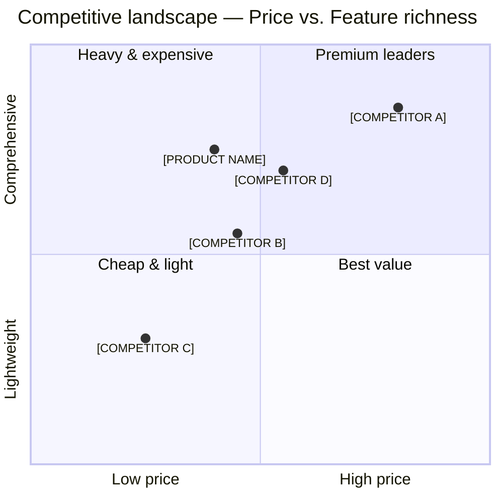

# Competitive Analysis

| | |
|---|---|
| **Product** | [PRODUCT NAME] |
| **Prepared by** | [NAME] |
| **Date** | [YYYY-MM-DD] |
| **Version** | v0.1 — Draft |
| **Status** | Draft |

---

## 1. Competitive Analysis Overview

- **Market category:** [CATEGORY — e.g. "Operations workspace for mid-market services teams"]
- **Number of direct competitors identified:** **[X]**
- **Number of indirect competitors / alternatives identified:** **[Y]**
- **Analysis methodology:** [Desk research / public docs / pricing pages / G2 + Capterra reviews / user interviews / trial signups / win-loss analysis]
- **Refresh cadence:** Quarterly, or sooner on a material market event (funding, acquisition, major release).

---

## 2. Competitive Landscape Map

The market is best understood along two axes:

- **X-axis — Price:** *Low ↔ High* (entry-level monthly cost per user)
- **Y-axis — Feature richness / depth:** *Lightweight ↔ Comprehensive*

> **Strategic position:** [PRODUCT NAME] targets the **best-value** quadrant — comprehensive enough for mid-market governance, priced below the incumbents, and faster to deploy than the heavy enterprise suites.

---

## 3. Direct Competitors

### 3.1 [COMPETITOR A] — Incumbent / Market Leader

- **Company overview:** [COMPETITOR A] is the long-established leader in [CATEGORY], founded in [YEAR] and serving [10,000+] customers globally. It is widely recognised but increasingly criticised for legacy UX and services-led implementation.
- **Target customer:** Enterprise ([1,000+] employees) in [INDUSTRY], typically procured through RFP.
- **Pricing model:** Per-seat, annual contracts only; published list prices start at **$[X] / user / month**, with negotiated enterprise discounts.

#### Key features

| Feature | [COMPETITOR A] | [COMPETITOR B] | [PRODUCT NAME] |
|---|---|---|---|
| Time-to-first-value | Weeks (services-led) | Days | **Minutes** |
| Modern UX / mobile-web | Dated | Modern | **Modern** |
| RBAC + audit log | ✅ (complex) | Partial | **✅ (simple)** |
| SSO (SAML / OIDC) | ✅ | OIDC only | **✅** |
| Public API | ✅ | ✅ | 🔄 Planned |
| Marketplace integrations | ✅ ([100+]) | ✅ ([30]) | 🔄 ([10] at launch) |
| Transparent pricing | ❌ | ✅ | **✅** |

- **Strengths:**
  - Brand recognition and procurement familiarity at the enterprise level.
  - Deep, configurable feature surface for complex deployments.
  - Mature partner / consultancy ecosystem.
  - Long compliance pedigree (SOC 2 Type II, ISO 27001, HIPAA).
- **Weaknesses:**
  - Services-led implementation; slow time-to-value.
  - Dated UI; weak adoption from daily users.
  - Opaque, negotiation-driven pricing.
  - Slow release cadence; long roadmap horizons.
- **Market positioning:** *"The enterprise standard for [CATEGORY] — buy it because no one gets fired for choosing us."*

---

### 3.2 [COMPETITOR B] — Modern Challenger

- **Company overview:** [COMPETITOR B] is a [Series B/C] challenger founded in [YEAR], known for a polished UX and a strong product-led motion. It primarily lands in tech-forward SMBs and has been moving up-market.
- **Target customer:** SMB to lower mid-market ([20–250] employees), tech-savvy operations teams.
- **Pricing model:** Per-seat with a free tier; published tiers from **$[X] / user / month**; annual discount available.

- **Strengths:**
  - Excellent UX and onboarding experience.
  - Strong product-led growth motion; viral inside teams.
  - Active community and content marketing.
  - Frequent release cadence visible to users.
- **Weaknesses:**
  - Governance and admin features (RBAC, audit, data residency) lag behind enterprise needs.
  - Limited services and partner ecosystem.
  - Pricing escalates quickly at scale.
  - Narrow workflow scope; users still piece together adjacent tools.
- **Market positioning:** *"The fast, friendly alternative to legacy [CATEGORY] tools — beloved by small teams."*

---

### 3.3 [COMPETITOR C] — Low-Cost / SMB Tool

- **Company overview:** [COMPETITOR C] is a low-priced, lightweight tool targeting very small teams and solo operators. It competes mostly on price and simplicity rather than depth.
- **Target customer:** Micro-SMB ([1–20] employees) and individual professionals.
- **Pricing model:** Flat low monthly fee or freemium; published tiers from **$[X] / user / month**.

- **Strengths:**
  - Low price; minimal commitment.
  - Very simple to set up; no learning curve.
  - Wide brand awareness in the SMB segment.
  - Generous free tier.
- **Weaknesses:**
  - Shallow feature depth; teams quickly outgrow it.
  - Weak admin and governance; not suitable for regulated buyers.
  - Limited integrations and APIs.
  - Inconsistent support quality.
- **Market positioning:** *"The cheap and easy way to start — until you outgrow it."*

---

### 3.4 [COMPETITOR D] — Adjacent / Horizontal Platform

- **Company overview:** [COMPETITOR D] is a horizontal work platform that customers configure to approximate [CATEGORY] use cases. Powerful but not purpose-built; heavy configuration required.
- **Target customer:** Mid-market and enterprise teams already standardised on the platform for other workflows.
- **Pricing model:** Per-seat, often bundled with the broader suite; effective price per user **$[X] / user / month**.

- **Strengths:**
  - Highly flexible; large template / community library.
  - Already inside many target accounts (incumbency advantage).
  - Strong ecosystem and integrations.
  - Enterprise-grade compliance posture.
- **Weaknesses:**
  - Requires significant configuration to fit [CATEGORY] workflows.
  - No opinionated workflow; quality of deployment varies wildly.
  - Admin/governance applied generically, not workflow-specific.
  - Reporting and analytics for [CATEGORY] are bolt-on at best.
- **Market positioning:** *"Build any workflow you want — including [CATEGORY], with enough effort."*

---

## 4. Indirect Competitors / Alternatives

| Alternative | Why Users Use It | Our Angle |
|---|---|---|
| Spreadsheets ([GOOGLE SHEETS / EXCEL]) | Free, flexible, already adopted; no procurement required. | Replace the manual, error-prone spreadsheet with structured workflows, audit, and notifications — without losing the flexibility teams value. |
| Email + chat ([SLACK / TEAMS]) | Status updates and decisions live in conversation threads. | Persist status, ownership, and history in one place; surface updates back into chat via integrations. |
| In-house / homegrown tools | Bespoke fit for the team's process; full control. | Lower TCO, faster cadence, security and compliance maintained for them — without an internal engineering tax. |
| Project management suites ([PROJECT MANAGEMENT TOOL]) | Used adjacent to [CATEGORY] for tasks and deadlines. | Native [CATEGORY] workflow; integrate (not replace) generic PM tools. |
| Industry-specific point tools | Tailored to one sub-workflow within [INDUSTRY]. | One workspace covers the full workflow; integrates with the point tool where it adds unique value. |
| "Do nothing" — manual process | No tool cost; no change-management effort. | Quantified ROI calculator and same-day setup remove the cost-of-change objection. |

---

## 5. Feature Comparison Matrix

Legend: **✅** supported · **❌** not supported · **🔄** planned / on roadmap

| Feature Category | Feature | [COMPETITOR A] | [COMPETITOR B] | [COMPETITOR C] | **[PRODUCT NAME]** |
|---|---|---|---|---|---|
| **Core features** | `[RESOURCE_A]` management | ✅ | ✅ | ✅ | **✅** |
| **Core features** | `[RESOURCE_B]` management | ✅ | ✅ | ✅ | **✅** |
| **Core features** | Workflow automations | ✅ | ✅ | ❌ | 🔄 |
| **Core features** | Templates & library | ✅ | ✅ | ❌ | **✅** |
| **Core features** | In-app & email notifications | ✅ | ✅ | ✅ | **✅** |
| **Core features** | Mobile-web responsive | Partial | ✅ | ✅ | **✅** |
| **Integrations** | [CRM PROVIDER] | ✅ | ✅ | ❌ | 🔄 |
| **Integrations** | [WORKSPACE PROVIDER] (Google / Microsoft) | ✅ | ✅ | Partial | **✅** |
| **Integrations** | [COMMS PROVIDER] (Slack / Teams) | ✅ | ✅ | ❌ | **✅** |
| **Integrations** | Zapier / Make | ✅ | ✅ | ✅ | 🔄 |
| **Integrations** | Public webhooks | ✅ | ✅ | ❌ | **✅** |
| **Security** | RBAC (roles & permissions) | ✅ | Partial | ❌ | **✅** |
| **Security** | SSO — OIDC (Google / Microsoft) | ✅ | ✅ | ❌ | **✅** |
| **Security** | SSO — SAML | ✅ | 🔄 | ❌ | 🔄 |
| **Security** | Audit log | ✅ | Partial | ❌ | **✅** |
| **Security** | SOC 2 Type II | ✅ | ✅ | ❌ | 🔄 |
| **Security** | GDPR DPA available | ✅ | ✅ | Partial | **✅** |
| **Security** | Data residency choice (US / EU) | ✅ | ❌ | ❌ | 🔄 |
| **Support** | Self-serve docs + community | ✅ | ✅ | ✅ | **✅** |
| **Support** | Email / chat support | ✅ | ✅ | Email only | **✅** |
| **Support** | Dedicated CSM (Enterprise) | ✅ | Optional | ❌ | **✅** |
| **Support** | 24×7 priority support | ✅ | ❌ | ❌ | 🔄 |
| **Pricing flexibility** | Free tier | ❌ | ✅ | ✅ | **✅** |
| **Pricing flexibility** | Monthly billing | ❌ | ✅ | ✅ | **✅** |
| **Pricing flexibility** | Annual billing & discount | ✅ | ✅ | ✅ | **✅** |
| **Pricing flexibility** | Transparent published pricing | ❌ | ✅ | ✅ | **✅** |
| **Pricing flexibility** | Self-serve upgrade / downgrade | ❌ | ✅ | ✅ | **✅** |
| **API access** | Documented public API | ✅ | ✅ | Partial | 🔄 |
| **API access** | API rate limits published | ✅ | ✅ | ❌ | **✅** |
| **API access** | Webhooks with signed delivery | ✅ | ✅ | ❌ | **✅** |
| **API access** | Bulk export of customer data | ✅ | ✅ | Partial | **✅** |

---

## 6. Our Differentiation

### 6.1 Top 5 differentiators

- **Time-to-first-value in under 10 minutes** — no services engagement, no IT review required to start.
- **Workflow + governance in one product** — RBAC, audit log, and SSO ship with the product, not behind a sales call.
- **Transparent, predictable pricing** — published tiers, monthly or annual, with self-serve upgrade and downgrade.
- **Modern, fast UX** — keyboard-first, mobile-web responsive, designed for daily users, not just administrators.
- **Open ecosystem** — documented APIs, webhooks, and full data export from day one; no lock-in.

### 6.2 Why we win

[PRODUCT NAME] wins where the buyer needs **enterprise-grade governance** but the daily users demand **a tool they actually want to open every morning**. [COMPETITOR A] solves the governance side at the cost of UX and speed, and forces every customer through a long, services-led implementation. [COMPETITOR B] delights daily users but lacks the RBAC, audit, and SSO depth that procurement and security teams require to approve a purchase. [COMPETITOR C] is a great starter tool that customers outgrow within a year. [PRODUCT NAME] sits in the **best-value quadrant** — comprehensive enough for the buyer, modern enough for the user, and priced and packaged to be approved without an RFP.

We compound that core advantage with **transparent pricing, an open ecosystem, and a published roadmap** — all of which lower the buyer's perceived risk. Customers can start free, upgrade self-serve, integrate via documented APIs, and export their data at any time. That combination is hard for incumbents to match without disrupting their existing pricing and channel models, and hard for SMB-focused challengers to match without rebuilding their governance story from scratch.

### 6.3 Where we're weak today

- **Brand recognition** is far behind [COMPETITOR A] — buyers we don't reach won't consider us.
- **Compliance certifications** (SOC 2 Type II, SAML SSO, regional data residency) are still in flight; some enterprise deals will block on these until shipped.
- **Public API and integrations marketplace** start narrow at launch — partner-driven distribution will lag for the first 1–2 quarters.
- **Workflow automations** are on the roadmap but not GA; power users will compare us unfavourably to [COMPETITOR A] / [COMPETITOR B] on this dimension.

---

## 7. Pricing Comparison

| Tier | [COMPETITOR A] | [COMPETITOR B] | [COMPETITOR C] | **[PRODUCT NAME]** | Notes |
|---|---|---|---|---|---|
| Free | — | $0 (capped) | $0 (capped) | **$0 (capped)** | Free tier widens the top of the funnel for PLG. |
| Entry / Starter | $[X] / user / mo | $[X] / user / mo | $[X] / user / mo | **$[19] / user / mo (Pro)** | We sit between the SMB and challenger tiers on price. |
| Mid-tier | $[X] / user / mo | $[X] / user / mo | n/a | **$[39] / user / mo (Business)** | Includes RBAC, audit, SSO — gated higher by competitors. |
| Enterprise | Custom (typically $[X]+ / user / mo) | Custom | n/a | **Custom** | Custom MSA / DPA, SAML, dedicated CSM, security pack. |
| Free trial | None on entry plans | [14] days | [7] days | **[14] days, no card** | Trial of the Pro plan; reverts to Free on expiry. |
| Annual discount | Required for entry | ~[15%] | ~[10%] | **~[17%]** | Annual default for Business / Enterprise. |
| Implementation services | Required ([$X]+) | Optional | None | **Optional** | Self-serve by design; services available for enterprise. |

---

## 8. Key Insights & Recommendations

1. **Defend the "best-value" quadrant.** Resist the temptation to chase enterprise feature parity at the cost of time-to-value or pricing transparency — that is precisely where the incumbents are weakest.
2. **Close the compliance gap fast.** SOC 2 Type II, SAML SSO, and a published trust centre unblock the largest concentration of mid-market and enterprise deals; treat these as P0 GTM enablers, not P1 features.
3. **Compete on TTFV publicly.** Make the "10 minutes to value" claim concrete with a public demo, sandbox, and a live ROI calculator on the website. This is our most copy-resistant differentiator.
4. **Invest early in 3–5 high-leverage integrations.** Customers evaluate against [WORKSPACE PROVIDER], [COMMS PROVIDER], and [CRM PROVIDER] checklist questions; absent integrations cost more deals than absent features.
5. **Position against [COMPETITOR A] on speed and price**, against [COMPETITOR B] on governance and depth, and against [COMPETITOR C] on growth-path ("won't outgrow it"). Equip sales with three distinct battlecards rather than a single generic one.
6. **Productize win-loss analysis from day one.** Capture loss reasons in the CRM and review monthly; competitive intelligence loses signal quickly without a feedback loop.
7. **Track the market quarterly.** Refresh the landscape map, feature matrix, and pricing comparison every quarter; brief sales and marketing on changes within one week of refresh.

---

## 9. Sources & Methodology

- **Public sources used:**
  - Vendor websites, pricing pages, security/trust pages, public docs and changelogs.
  - G2, Capterra, TrustRadius reviews (sample size, recency noted per vendor).
  - Analyst coverage ([ANALYST FIRM REPORT TITLE], [DATE]).
  - Funding and headcount data ([CRUNCHBASE / PITCHBOOK / LINKEDIN]).
- **Primary research:**
  - **[N]** customer interviews (mix of prospects, churned customers from competitors, and current users).
  - **[N]** trial signups across direct competitors with documented onboarding and time-to-value notes.
  - Win-loss reviews from the last **[2]** quarters (CRM source).
- **Limitations / caveats:**
  - Pricing for [COMPETITOR A] and [COMPETITOR D] is negotiated; published numbers are anchors, not actuals.
  - Feature matrix reflects the public surface as of **[DATE]**; vendors may ship updates between refreshes.
- **Refresh process:**
  - **Owner:** [PRODUCT MARKETING / COMPETITIVE INTEL LEAD].
  - **Cadence:** Quarterly full refresh; ad-hoc updates on material market events.
  - **Distribution:** Updates published to `#competitive-intel` and reviewed in the monthly GTM operating review.
  - **Versioning:** Each refresh increments the document version and updates the date and changelog.
