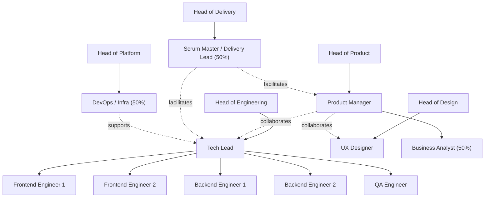
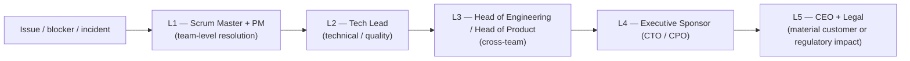

# Team Structure and RACI Matrix

| | |
|---|---|
| **Product** | [PRODUCT NAME] |
| **Date** | [YYYY-MM-DD] |
| **Owner** | [PM / Delivery Lead — NAME] |
| **Version** | v0.1 — Draft |
| **Status** | Draft |

> This document defines who is on the [PRODUCT NAME] delivery team, how they are organised, and **who is Responsible / Accountable / Consulted / Informed (RACI)** for each major activity in the software development lifecycle.

---

## 1. Team Overview

| Role | Name | Allocation | Reporting To | Start Date |
|---|---|---|---|---|
| Product Manager (PM) | [NAME] | 100% | [Head of Product] | [DATE] |
| Tech Lead | [NAME] | 100% | [Head of Engineering] | [DATE] |
| Frontend Engineer (1) | [NAME] | 100% | Tech Lead | [DATE] |
| Frontend Engineer (2) | [NAME] | 100% | Tech Lead | [DATE] |
| Backend Engineer (1) | [NAME] | 100% | Tech Lead | [DATE] |
| Backend Engineer (2) | [NAME] | 100% | Tech Lead | [DATE] |
| UX Designer | [NAME] | 100% | [Head of Design] | [DATE] |
| QA Engineer | [NAME] | 100% | Tech Lead | [DATE] |
| DevOps / Infrastructure Engineer | [NAME] | 50% (shared) | [Head of Platform] | [DATE] |
| Business Analyst | [NAME] | 50% (shared) | PM | [DATE] |
| Scrum Master / Delivery Lead | [NAME] | 50% (shared) | [Head of Delivery] | [DATE] |

> Allocation reflects the share of weekly capacity dedicated to [PRODUCT NAME]. Update on every change.

---

## 2. Org Chart

> Solid arrows indicate reporting lines; dashed arrows indicate primary collaboration lines.

---

## 3. Role Responsibilities

### 3.1 Product Manager (PM)

- **Responsibilities:**
  - Owns the product vision, roadmap, and prioritised backlog for [PRODUCT NAME].
  - Writes and grooms epics and user stories with clear acceptance criteria.
  - Aligns engineering, design, and stakeholders on scope and trade-offs.
  - Defines success metrics and reviews them with the team weekly.
  - Represents customer voice in every planning conversation.
- **Skills required:** Product discovery, user research, prioritisation frameworks (RICE / WSJF), strong written communication, basic SQL/analytics.
- **Success metrics:** On-time delivery of committed roadmap, activation/retention KPI movement, stakeholder NPS on product communication.

### 3.2 Tech Lead

- **Responsibilities:**
  - Owns the technical architecture and end-to-end quality of the codebase.
  - Breaks epics into technical work; sequences delivery; resolves blockers.
  - Sets engineering standards (code style, testing, observability, security).
  - Coaches engineers; runs design reviews and code reviews.
  - Final approver on production-bound merges to `main`.
- **Skills required:** System design, distributed systems basics, performance and security awareness, mentoring, hands-on coding in the team's stack.
- **Success metrics:** Sprint predictability, defect-escape rate, change-failure rate, P95 latency and uptime SLAs.

### 3.3 Frontend Engineer

- **Responsibilities:**
  - Implements UI features against the design system; writes unit and component tests.
  - Translates design specs to accessible (WCAG 2.1 AA) and performant code.
  - Instruments user-facing telemetry; debugs UX regressions.
  - Participates in code reviews and refinement sessions.
  - Pairs with backend engineers on contract design and integration.
- **Skills required:** React/TypeScript (or team's stack), accessibility, performance budgets, browser/devtools fluency, automated testing.
- **Success metrics:** Story throughput, bug-fix lead time, Lighthouse / perf budget adherence, accessibility audit pass rate.

### 3.4 Backend Engineer

- **Responsibilities:**
  - Implements API endpoints, jobs, and data models.
  - Writes unit and integration tests; instruments logs, metrics, and traces.
  - Owns data correctness, idempotency, and authorization on every endpoint.
  - Collaborates with frontend on API contracts and error envelopes.
  - Participates in on-call rotation.
- **Skills required:** [Node.js / Python / Go] (team stack), relational data modelling, API design, testing, security fundamentals.
- **Success metrics:** Endpoint reliability (P95/P99 latency, error rate), test coverage on changed code, mean-time-to-recovery (MTTR) on owned services.

### 3.5 UX Designer

- **Responsibilities:**
  - Designs flows, wireframes, and high-fidelity mockups for upcoming work.
  - Maintains and evolves the design system and component library.
  - Plans and runs prototype validation sessions with users.
  - Partners with PM on discovery and with engineering on implementation handoff.
  - Reviews implementation against designs before release.
- **Skills required:** Interaction design, information architecture, design systems, accessibility, qualitative research methods, [DESIGN TOOL].
- **Success metrics:** Task success rate from usability testing, SUS score, design-review turnaround time, design-system adoption.

### 3.6 QA Engineer

- **Responsibilities:**
  - Plans and writes test cases against acceptance criteria.
  - Owns the integration and end-to-end (E2E) test suites.
  - Runs exploratory testing on each release candidate.
  - Triages bugs with PM and Tech Lead; tracks defects to closure.
  - Owns release-readiness sign-off in the staging environment.
- **Skills required:** Test design, Playwright/Cypress (or team's E2E tool), API testing, defect lifecycle management, basic SQL.
- **Success metrics:** Defect-escape rate to production, E2E suite stability (flake rate), release-cycle time, regression-coverage growth.

### 3.7 DevOps / Infrastructure Engineer

- **Responsibilities:**
  - Owns CI/CD pipelines, infrastructure-as-code, and environment management.
  - Operates production observability (logs, metrics, traces, alerts).
  - Manages secrets, network/firewall rules, and access controls.
  - Leads on incident response runbooks and disaster-recovery drills.
  - Optimises cloud cost and enforces tagging/governance.
- **Skills required:** [AWS / GCP / Azure], Terraform/Pulumi, Kubernetes (or chosen runtime), observability stack, security hardening.
- **Success metrics:** Deployment frequency, change-failure rate, MTTR, uptime SLA, monthly cloud-cost variance vs. budget.

### 3.8 Business Analyst

- **Responsibilities:**
  - Captures business requirements and translates them into PM-ready inputs.
  - Builds and maintains analytics dashboards and KPI definitions.
  - Runs ad-hoc analyses to support roadmap and pricing decisions.
  - Liaises with finance and GTM on data and reporting needs.
  - Documents process and decision logs for the delivery team.
- **Skills required:** SQL, dashboarding ([LOOKER / METABASE / TABLEAU]), requirements elicitation, written communication, basic statistics.
- **Success metrics:** Decision-cycle time on data requests, dashboard adoption, requirements-to-rework ratio.

### 3.9 Scrum Master / Delivery Lead

- **Responsibilities:**
  - Facilitates the team's Scrum/Kanban ceremonies and removes blockers.
  - Tracks sprint health, velocity, and risks; reports weekly.
  - Coaches the team on Agile practices and continuous improvement.
  - Coordinates dependencies with neighbouring teams.
  - Owns the team's working agreements and retro action items.
- **Skills required:** Servant leadership, facilitation, conflict resolution, Agile metrics, [TICKET TOOL].
- **Success metrics:** Sprint commitment vs. delivery, blocker cycle time, retro action-item closure rate, team health survey trend.

---

## 4. RACI Matrix

**Legend:** **R** = Responsible (does the work) · **A** = Accountable (single owner, one per row) · **C** = Consulted (two-way input) · **I** = Informed (kept in the loop)

| # | Activity | PM | Tech Lead | FE Dev | BE Dev | UX | QA | DevOps | Business |
|---|---|---|---|---|---|---|---|---|---|
| 1 | Product requirements definition | **A/R** | C | I | I | C | I | I | C |
| 2 | Roadmap planning | **A/R** | C | I | I | C | I | I | C |
| 3 | UI / UX design | C | C | C | I | **A/R** | I | I | I |
| 4 | Architecture design | C | **A/R** | C | C | I | I | C | I |
| 5 | Story refinement & estimation | A | R | R | R | C | C | I | I |
| 6 | Sprint planning | C | C | R | R | R | R | I | I |
| 7 | Feature development — frontend | I | A | **R** | C | C | C | I | I |
| 8 | Feature development — backend | I | A | C | **R** | I | C | C | I |
| 9 | Code review | I | A | R | R | I | I | I | I |
| 10 | Unit testing | I | A | **R** | **R** | I | C | I | I |
| 11 | Integration testing | I | C | R | R | I | **A/R** | I | I |
| 12 | End-to-end (E2E) testing | I | C | C | C | I | **A/R** | I | I |
| 13 | User Acceptance Testing (UAT) | **A/R** | I | I | I | C | C | I | C |
| 14 | Deployment to staging | I | A | C | C | I | C | **R** | I |
| 15 | Deployment to production | I | **A** | C | C | I | C | **R** | I |
| 16 | Bug triage | **A** | C | C | C | I | **R** | I | I |
| 17 | Security review | C | C | I | C | I | C | C | A/R *([Security Lead])* |
| 18 | Documentation (product + technical) | A | C | R | R | C | C | C | I |
| 19 | Stakeholder reporting | **A/R** | C | I | I | I | I | I | C |
| 20 | Vendor / tool selection | C | C | C | C | C | C | A | C *([Finance])* |
| 21 | On-call rotation | I | A | I | R | I | I | **R** | I |
| 22 | Incident response | I | **A** | R | R | I | C | **R** | I |
| 23 | Retrospectives | C | C | R | R | R | R | C | I (facilitated by Scrum Master) |
| 24 | Release-notes / changelog | A | C | R | R | C | C | I | I |
| 25 | Budget tracking & cost optimisation | C | C | I | I | I | I | C | **A/R** *(with [Finance])* |

> Where **A** appears outside the column set (e.g. Security Lead, Finance), the cell explicitly names the accountable role from a partner team. Each activity has **exactly one A**.

---

## 5. Communication Protocols

| Meeting | Frequency | Attendees | Owner | Format |
|---|---|---|---|---|
| Daily standup | Daily, 15 min | Whole delivery team | Scrum Master | Live or async in [COMMS PROVIDER]; what I did / what I'll do / blockers. |
| Backlog refinement | Weekly, 60 min | PM, Tech Lead, FE/BE leads, UX, QA | PM | Walk top of backlog; size and clarify acceptance criteria. |
| Sprint planning | Bi-weekly, 90 min | Whole delivery team | Scrum Master | Confirm sprint goal; pull stories until capacity is met. |
| Sprint review / demo | Bi-weekly, 45 min | Delivery team + stakeholders | PM | Live demo of completed work; capture feedback. |
| Sprint retrospective | Bi-weekly, 60 min | Whole delivery team | Scrum Master | What went well / didn't / change next sprint; track actions. |
| Architecture review | Weekly or on-demand, 60 min | Tech Lead, BE/FE leads, DevOps, Security | Tech Lead | Walk RFCs/design docs; record decisions in `docs/`. |
| Stakeholder update | Weekly, 30 min | PM, Tech Lead, sponsors, [GTM Lead], [CS Lead] | PM | Status, risks, KPIs; written digest follows. |
| Incident review | Within 5 business days of an incident | Tech Lead, on-call, DevOps, Security, PM | Tech Lead | Blameless post-mortem; published in `docs/operations/`. |
| All-hands | Monthly, 60 min | All product + engineering staff | [Head of Product] | Roadmap, wins, hires, Q&A. |
| Product / GTM sync | Bi-weekly, 30 min | PM, [GTM Lead], [CS Lead], [Marketing Lead] | PM | Launch pipeline, customer feedback, content needs. |

---

## 6. Escalation Path

When a blocker, defect, or incident exceeds the team's standing authority, escalate along this path. Use the next level only if the prior contact cannot resolve within their SLA.

### Escalation SLAs (acknowledgement → mitigation)

| Severity | Definition | Acknowledge | Mitigate / Workaround | Resolve |
|---|---|---|---|---|
| **P1 — Critical** | Production outage, data exposure, security incident, or full team blocked. | **15 minutes** | **1 hour** | **8 hours** |
| **P2 — High** | Major feature broken, significant degradation, or sprint goal at serious risk. | **1 hour** | **4 hours** | **2 business days** |
| **P3 — Medium** | Single-team blocker; non-critical defect with workaround. | **1 business day** | **3 business days** | Next sprint |
| **P4 — Low** | Cosmetic, minor inconvenience, or backlog-eligible improvement. | **3 business days** | Backlog | Per backlog priority |

### Escalation rules of engagement

- Always **acknowledge first**, then escalate — silence is the worst signal.
- Escalations to **L3 and above** must include: severity, customer impact, current mitigation, owner, and next checkpoint.
- **P1 incidents** open a war-room channel in [COMMS PROVIDER] and page on-call automatically; status updates every **30 minutes** until mitigated.
- A **post-incident review** is mandatory for every P1 and recommended for every P2; published in `docs/operations/` within **5 business days**.
- Repeated escalations on the same root cause trigger a **dedicated remediation epic** in the next sprint.
