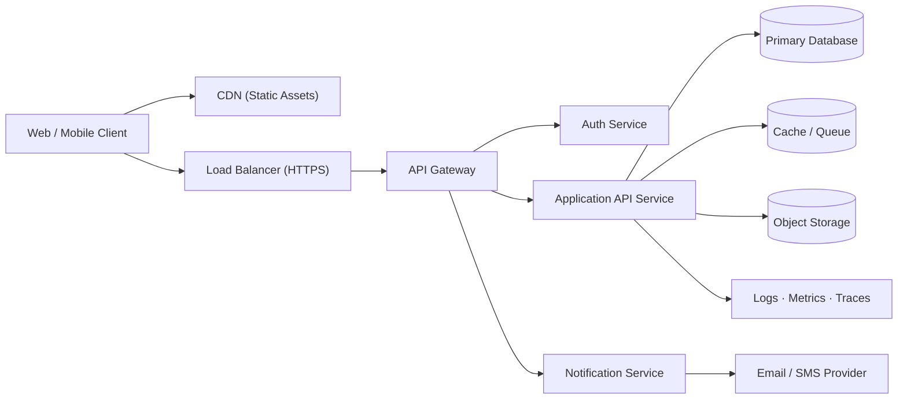

# System Architecture Document

| | |
|---|---|
| **Title** | System Architecture Document — [PRODUCT NAME] |
| **Version** | v0.1 — Draft |
| **Date** | [YYYY-MM-DD] |
| **Author** | [Your Name] |
| **Status** | Draft |

---

## 1. Executive Summary

[PRODUCT NAME] is a SaaS application that enables [TARGET USER] to [CORE VALUE PROPOSITION]. It is delivered as a multi-tenant cloud service accessed through a modern web client and a public API. This document describes the prototype-stage architecture, its core components, and the open decisions that need to be resolved before general availability.

---

## 2. System Overview

[PRODUCT NAME] follows a layered, service-oriented architecture. A single-page web client communicates with a backend API over HTTPS; the API encapsulates business logic, persists state in a managed relational database, and delegates cross-cutting concerns (authentication, file storage, transactional email) to managed third-party services. Infrastructure runs on a single cloud provider with separate development, staging, and production environments.

### 2.1 Technology Stack

| Layer | Technology | Version | Notes |
|---|---|---|---|
| Frontend | [FRONTEND FRAMEWORK] | [VERSION] | SPA delivered via CDN; communicates with API over JSON/HTTPS. |
| Backend / API | [BACKEND LANGUAGE / FRAMEWORK] | [VERSION] | REST + selected GraphQL endpoints; stateless, horizontally scalable. |
| Database | [DATABASE] | [VERSION] | Primary OLTP store; managed service with automated backups. |
| Authentication | [AUTH PROVIDER] | [VERSION] | OIDC / OAuth2; SSO and MFA support. |
| Hosting / Cloud | [AWS / GCP / Azure — TBD] | n/a | Containerised workloads behind a managed load balancer. |
| CI / CD | [CI PROVIDER] | [VERSION] | Trunk-based; automated build, test, and deploy pipelines. |
| Monitoring | [APM / LOGGING STACK] | [VERSION] | Metrics, traces, structured logs, and alerting. |

---

## 3. Architecture Diagram

---

## 4. Core Components

### 4.1 Frontend Application
- **Responsibility:** Renders the user interface, handles client-side routing, validation, and state management.
- **Technology:** [FRONTEND FRAMEWORK]
- **Key interactions:** Loads bundled assets from the CDN; calls the API Gateway over HTTPS; redirects to the Auth Service for sign-in.

### 4.2 API Layer
- **Responsibility:** Exposes business capabilities, enforces authorization, validates input, and orchestrates calls to the database and downstream services.
- **Technology:** [BACKEND LANGUAGE / FRAMEWORK]
- **Key interactions:** Reads/writes the primary database; publishes/consumes background jobs via the queue; calls the storage and notification services.

### 4.3 Database
- **Responsibility:** Durable system of record for tenants, users, and domain entities.
- **Technology:** [DATABASE]
- **Key interactions:** Accessed exclusively through the API layer; backed up nightly with point-in-time recovery.

### 4.4 Authentication Service
- **Responsibility:** Identity, sign-in, session/token issuance, MFA, and SSO.
- **Technology:** [AUTH PROVIDER]
- **Key interactions:** Issues access/refresh tokens to the client; the API Gateway validates tokens on every request.

### 4.5 Storage
- **Responsibility:** Stores user-uploaded files, exports, and large generated artifacts.
- **Technology:** [OBJECT STORAGE]
- **Key interactions:** API generates pre-signed upload/download URLs; clients transfer files directly to/from the bucket.

### 4.6 Email / Notifications
- **Responsibility:** Sends transactional email, in-app notifications, and (optionally) SMS.
- **Technology:** [EMAIL / NOTIFICATION PROVIDER]
- **Key interactions:** Triggered by the API or by background workers consuming events from the queue.

---

## 5. Data Flow Description

A typical authenticated user request flows through the system as follows:

1. **Sign-in.** The user visits the web client; the SPA redirects them to the Auth Service, which authenticates the user (password / SSO / MFA) and returns access and refresh tokens.
2. **Client request.** The user performs an action; the SPA issues an HTTPS request to the API Gateway with the access token in the `Authorization` header.
3. **Gateway validation.** The API Gateway verifies the token signature, expiry, and required scopes, then routes the request to the appropriate API service.
4. **Business logic.** The API service authorizes the request against the tenant/role model, validates the payload, and executes the use case.
5. **Persistence.** The service reads or writes the primary database within a transaction; long-running or asynchronous work is enqueued to the cache/queue layer.
6. **Side effects.** Where applicable, the service generates signed URLs for storage operations and emits events for the Notification Service.
7. **Response.** The API returns a structured JSON response; the client updates UI state and surfaces any errors to the user.
8. **Observability.** Each hop emits structured logs, metrics, and a distributed trace to the monitoring stack.

---

## 6. Infrastructure & Hosting

- **Cloud provider:** [AWS / GCP / Azure — TBD]
- **Region strategy:** Single primary region for the prototype; multi-region considered for GA.
- **Environments:** Development, Staging, Production — fully isolated networks, credentials, and data.

| Environment | URL | Purpose | Access Level |
|---|---|---|---|
| Development | `https://dev.[PRODUCT-DOMAIN]` | Active feature development; ephemeral data. | Engineering only |
| Staging | `https://staging.[PRODUCT-DOMAIN]` | Pre-release validation, UAT, integration testing. | Internal team + selected pilots |
| Production | `https://app.[PRODUCT-DOMAIN]` | Live customer traffic. | Authenticated end users |

---

## 7. Scalability Considerations

- **Horizontal scaling:** API services are stateless and scale out behind the load balancer based on CPU and request-rate metrics.
- **Vertical scaling:** Reserved primarily for the database tier; CPU/RAM/IOPS scale up during peak load before sharding is considered.
- **Caching:** Read-heavy endpoints sit behind a shared cache to reduce database pressure; client assets are cached aggressively at the CDN.
- **Asynchronous work:** Long-running and bursty workloads (exports, notifications, integrations) run on background workers consuming a durable queue.
- **Expected initial load:** [X concurrent users], [Y requests/second], [Z GB of data per tenant].
- **Bottlenecks to monitor:**
  - Database connection pool saturation and slow queries
  - API p95/p99 latency under sustained load
  - Queue depth and worker lag
  - Third-party rate limits (auth, email, payments)
  - CDN cache hit ratio for static assets

---

## 8. Third-Party Integrations

| Service | Purpose | Integration Type | Owner |
|---|---|---|---|
| [AUTH PROVIDER] | Identity, SSO, MFA | OIDC / OAuth2 | Platform |
| [EMAIL PROVIDER] | Transactional email | REST API + webhooks | Platform |
| [PAYMENTS PROVIDER] | Subscription billing | REST API + webhooks | Billing |
| [ANALYTICS PROVIDER] | Product analytics | Client SDK + server events | Product |
| [ERROR TRACKING] | Exception monitoring | SDK | Engineering |
| [OBSERVABILITY VENDOR] | Metrics, logs, traces | Agent / OTel exporter | Platform |
| [SUPPORT / HELPDESK] | Customer support | REST API + embed widget | CX |

---

## 9. Open Questions / Decisions Pending

- Final selection of cloud provider ([AWS / GCP / Azure]) and the rationale for the choice.
- Whether the API exposes REST only, or a hybrid REST + GraphQL surface for selected use cases.
- Multi-tenancy model: shared schema with tenant ID, schema-per-tenant, or database-per-tenant.
- Authentication strategy for the public API: short-lived JWTs, opaque tokens, or signed API keys.
- Background-job runtime: managed queue + workers vs. an event-streaming platform.
- Disaster-recovery objectives (RPO / RTO) and the corresponding backup/replication strategy.
- Data-residency commitments and the regional deployment model required to meet them.

---

## 10. Revision History

| Version | Date | Author | Changes |
|---|---|---|---|
| v0.1 | [YYYY-MM-DD] | [Your Name] | Initial draft of the system architecture document. |
