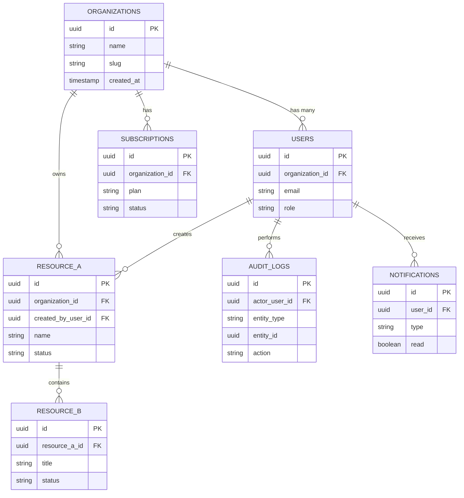

# Database Schema Documentation

| | |
|---|---|
| **Title** | Database Schema — [PRODUCT NAME] |
| **Version** | v0.1 — Draft |
| **Database Type** | [PostgreSQL / MySQL / MongoDB — TBD] |
| **Date** | [YYYY-MM-DD] |
| **Author** | [Your Name] |
| **Status** | Draft |

---

## 1. Overview

[PRODUCT NAME] is a multi-tenant SaaS application. Its data model is centred on **organizations** (tenants) that contain **users**, the core domain resources `[RESOURCE_A]` and `[RESOURCE_B]`, an immutable **audit log**, billing **subscriptions**, and **notifications**. The schema is optimised for OLTP access patterns from the API layer; analytics and reporting workloads run from a downstream warehouse.

**Key design decisions**

- **UUID primary keys** on every table — generated at the database layer; safe to expose externally and to merge across environments.
- **Soft deletes** via a nullable `deleted_at` timestamp on every business table; rows are filtered by `deleted_at IS NULL` in application queries.
- **`created_at` and `updated_at` on all tables** — `created_at` defaults to `now()`; `updated_at` is maintained by a trigger or ORM hook.
- **Tenant isolation** — every domain table carries an `organization_id` foreign key; row-level security or application-level guards enforce isolation.
- **Append-only audit log** — `audit_logs` is never updated or deleted by application code.

---

## 2. Entity Relationship Summary



---

## 3. Table Definitions

### 3.a `users`

**Purpose:** Authenticated end users belonging to an organization.

| Column Name | Data Type | Nullable | Default | Description |
|---|---|---|---|---|
| `id` | `uuid` | no | `gen_random_uuid()` | Primary key. |
| `organization_id` | `uuid` | no | — | FK → `organizations.id`. Tenant the user belongs to. |
| `email` | `citext` | no | — | Unique login identifier (case-insensitive). |
| `password_hash` | `text` | yes | `NULL` | Argon2/bcrypt hash; null when SSO-only. |
| `name` | `text` | no | — | Display name. |
| `role` | `text` | no | `'member'` | One of `owner`, `admin`, `member`, `viewer`. |
| `avatar_url` | `text` | yes | `NULL` | Public HTTPS URL. |
| `last_login_at` | `timestamptz` | yes | `NULL` | Timestamp of most recent successful login. |
| `created_at` | `timestamptz` | no | `now()` | Row creation timestamp. |
| `updated_at` | `timestamptz` | no | `now()` | Row last-modified timestamp. |
| `deleted_at` | `timestamptz` | yes | `NULL` | Soft-delete marker. |

- **Primary key:** `id`
- **Foreign keys:** `organization_id → organizations(id)`
- **Indexes:** `UNIQUE (organization_id, email)`, `INDEX (organization_id)`, `INDEX (deleted_at)`

```sql
CREATE TABLE users (
    id              UUID        PRIMARY KEY DEFAULT gen_random_uuid(),
    organization_id UUID        NOT NULL REFERENCES organizations(id) ON DELETE RESTRICT,
    email           CITEXT      NOT NULL,
    password_hash   TEXT,
    name            TEXT        NOT NULL,
    role            TEXT        NOT NULL DEFAULT 'member',
    avatar_url      TEXT,
    last_login_at   TIMESTAMPTZ,
    created_at      TIMESTAMPTZ NOT NULL DEFAULT now(),
    updated_at      TIMESTAMPTZ NOT NULL DEFAULT now(),
    deleted_at      TIMESTAMPTZ,
    CONSTRAINT users_org_email_unique UNIQUE (organization_id, email)
);
CREATE INDEX users_organization_id_idx ON users (organization_id);
CREATE INDEX users_deleted_at_idx      ON users (deleted_at);
```

---

### 3.b `organizations`

**Purpose:** Top-level tenant container; every other domain row belongs to exactly one organization.

| Column Name | Data Type | Nullable | Default | Description |
|---|---|---|---|---|
| `id` | `uuid` | no | `gen_random_uuid()` | Primary key. |
| `name` | `text` | no | — | Human-readable organization name. |
| `slug` | `text` | no | — | URL-safe identifier (unique, lowercase). |
| `billing_email` | `citext` | yes | `NULL` | Email used for billing correspondence. |
| `plan` | `text` | no | `'free'` | Cached current plan code; source of truth is `subscriptions`. |
| `created_at` | `timestamptz` | no | `now()` | Row creation timestamp. |
| `updated_at` | `timestamptz` | no | `now()` | Row last-modified timestamp. |
| `deleted_at` | `timestamptz` | yes | `NULL` | Soft-delete marker. |

- **Primary key:** `id`
- **Foreign keys:** none
- **Indexes:** `UNIQUE (slug)`, `INDEX (deleted_at)`

```sql
CREATE TABLE organizations (
    id            UUID        PRIMARY KEY DEFAULT gen_random_uuid(),
    name          TEXT        NOT NULL,
    slug          TEXT        NOT NULL,
    billing_email CITEXT,
    plan          TEXT        NOT NULL DEFAULT 'free',
    created_at    TIMESTAMPTZ NOT NULL DEFAULT now(),
    updated_at    TIMESTAMPTZ NOT NULL DEFAULT now(),
    deleted_at    TIMESTAMPTZ,
    CONSTRAINT organizations_slug_unique UNIQUE (slug)
);
CREATE INDEX organizations_deleted_at_idx ON organizations (deleted_at);
```

---

### 3.c `[RESOURCE_A]`

**Purpose:** Primary domain entity (e.g. *projects*, *workspaces*, *campaigns*). Replace `[RESOURCE_A]` with the concrete name.

| Column Name | Data Type | Nullable | Default | Description |
|---|---|---|---|---|
| `id` | `uuid` | no | `gen_random_uuid()` | Primary key. |
| `organization_id` | `uuid` | no | — | FK → `organizations.id`. |
| `created_by_user_id` | `uuid` | no | — | FK → `users.id`. |
| `name` | `text` | no | — | Human-readable name. |
| `description` | `text` | yes | `NULL` | Optional long description. |
| `status` | `text` | no | `'draft'` | One of `draft`, `active`, `archived`. |
| `metadata` | `jsonb` | no | `'{}'::jsonb` | Free-form, validated at the application layer. |
| `created_at` | `timestamptz` | no | `now()` | Row creation timestamp. |
| `updated_at` | `timestamptz` | no | `now()` | Row last-modified timestamp. |
| `deleted_at` | `timestamptz` | yes | `NULL` | Soft-delete marker. |

- **Primary key:** `id`
- **Foreign keys:** `organization_id → organizations(id)`, `created_by_user_id → users(id)`
- **Indexes:** `INDEX (organization_id)`, `INDEX (status)`, `INDEX (deleted_at)`

```sql
CREATE TABLE [RESOURCE_A] (
    id                  UUID        PRIMARY KEY DEFAULT gen_random_uuid(),
    organization_id     UUID        NOT NULL REFERENCES organizations(id) ON DELETE RESTRICT,
    created_by_user_id  UUID        NOT NULL REFERENCES users(id)         ON DELETE RESTRICT,
    name                TEXT        NOT NULL,
    description         TEXT,
    status              TEXT        NOT NULL DEFAULT 'draft',
    metadata            JSONB       NOT NULL DEFAULT '{}'::jsonb,
    created_at          TIMESTAMPTZ NOT NULL DEFAULT now(),
    updated_at          TIMESTAMPTZ NOT NULL DEFAULT now(),
    deleted_at          TIMESTAMPTZ
);
CREATE INDEX [RESOURCE_A]_organization_id_idx ON [RESOURCE_A] (organization_id);
CREATE INDEX [RESOURCE_A]_status_idx          ON [RESOURCE_A] (status);
CREATE INDEX [RESOURCE_A]_deleted_at_idx      ON [RESOURCE_A] (deleted_at);
```

---

### 3.d `[RESOURCE_B]`

**Purpose:** Child entity scoped to `[RESOURCE_A]` (e.g. *tasks*, *items*, *records*). Replace `[RESOURCE_B]` with the concrete name.

| Column Name | Data Type | Nullable | Default | Description |
|---|---|---|---|---|
| `id` | `uuid` | no | `gen_random_uuid()` | Primary key. |
| `[resource_a]_id` | `uuid` | no | — | FK → `[RESOURCE_A].id`. |
| `assignee_user_id` | `uuid` | yes | `NULL` | FK → `users.id`. |
| `title` | `text` | no | — | Short title. |
| `description` | `text` | yes | `NULL` | Free-text body. |
| `status` | `text` | no | `'todo'` | One of `todo`, `in_progress`, `blocked`, `done`. |
| `due_date` | `date` | yes | `NULL` | Optional due date. |
| `position` | `integer` | no | `0` | Sort key within the parent. |
| `created_at` | `timestamptz` | no | `now()` | Row creation timestamp. |
| `updated_at` | `timestamptz` | no | `now()` | Row last-modified timestamp. |
| `deleted_at` | `timestamptz` | yes | `NULL` | Soft-delete marker. |

- **Primary key:** `id`
- **Foreign keys:** `[resource_a]_id → [RESOURCE_A](id)`, `assignee_user_id → users(id)`
- **Indexes:** `INDEX ([resource_a]_id)`, `INDEX (assignee_user_id)`, `INDEX (status)`, `INDEX (deleted_at)`

```sql
CREATE TABLE [RESOURCE_B] (
    id                UUID        PRIMARY KEY DEFAULT gen_random_uuid(),
    [resource_a]_id   UUID        NOT NULL REFERENCES [RESOURCE_A](id) ON DELETE CASCADE,
    assignee_user_id  UUID        REFERENCES users(id) ON DELETE SET NULL,
    title             TEXT        NOT NULL,
    description       TEXT,
    status            TEXT        NOT NULL DEFAULT 'todo',
    due_date          DATE,
    position          INTEGER     NOT NULL DEFAULT 0,
    created_at        TIMESTAMPTZ NOT NULL DEFAULT now(),
    updated_at        TIMESTAMPTZ NOT NULL DEFAULT now(),
    deleted_at        TIMESTAMPTZ
);
CREATE INDEX [RESOURCE_B]_[resource_a]_id_idx ON [RESOURCE_B] ([resource_a]_id);
CREATE INDEX [RESOURCE_B]_assignee_idx        ON [RESOURCE_B] (assignee_user_id);
CREATE INDEX [RESOURCE_B]_status_idx          ON [RESOURCE_B] (status);
CREATE INDEX [RESOURCE_B]_deleted_at_idx      ON [RESOURCE_B] (deleted_at);
```

---

### 3.e `audit_logs`

**Purpose:** Append-only record of every state-changing action performed in the system.

| Column Name | Data Type | Nullable | Default | Description |
|---|---|---|---|---|
| `id` | `uuid` | no | `gen_random_uuid()` | Primary key. |
| `organization_id` | `uuid` | no | — | FK → `organizations.id`. |
| `actor_user_id` | `uuid` | yes | `NULL` | FK → `users.id`; `NULL` for system actions. |
| `entity_type` | `text` | no | — | E.g. `users`, `[RESOURCE_A]`. |
| `entity_id` | `uuid` | no | — | ID of the affected row. |
| `action` | `text` | no | — | E.g. `created`, `updated`, `deleted`, `approved`. |
| `previous_value` | `jsonb` | yes | `NULL` | Snapshot of the row before the change. |
| `new_value` | `jsonb` | yes | `NULL` | Snapshot of the row after the change. |
| `ip_address` | `inet` | yes | `NULL` | Source IP, when available. |
| `user_agent` | `text` | yes | `NULL` | Source user-agent, when available. |
| `created_at` | `timestamptz` | no | `now()` | When the action occurred. |

- **Primary key:** `id`
- **Foreign keys:** `organization_id → organizations(id)`, `actor_user_id → users(id)`
- **Indexes:** `INDEX (organization_id, created_at DESC)`, `INDEX (entity_type, entity_id)`

```sql
CREATE TABLE audit_logs (
    id              UUID        PRIMARY KEY DEFAULT gen_random_uuid(),
    organization_id UUID        NOT NULL REFERENCES organizations(id) ON DELETE RESTRICT,
    actor_user_id   UUID        REFERENCES users(id) ON DELETE SET NULL,
    entity_type     TEXT        NOT NULL,
    entity_id       UUID        NOT NULL,
    action          TEXT        NOT NULL,
    previous_value  JSONB,
    new_value       JSONB,
    ip_address      INET,
    user_agent      TEXT,
    created_at      TIMESTAMPTZ NOT NULL DEFAULT now()
);
CREATE INDEX audit_logs_org_time_idx     ON audit_logs (organization_id, created_at DESC);
CREATE INDEX audit_logs_entity_idx       ON audit_logs (entity_type, entity_id);
```

---

### 3.f `subscriptions`

**Purpose:** Billing subscription per organization, mirrored from the payments provider.

| Column Name | Data Type | Nullable | Default | Description |
|---|---|---|---|---|
| `id` | `uuid` | no | `gen_random_uuid()` | Primary key. |
| `organization_id` | `uuid` | no | — | FK → `organizations.id` (one active row per org). |
| `provider` | `text` | no | `'[PAYMENTS PROVIDER]'` | E.g. `stripe`. |
| `provider_subscription_id` | `text` | no | — | External subscription identifier. |
| `plan` | `text` | no | — | Plan code (`free`, `pro`, `enterprise`, …). |
| `status` | `text` | no | — | `trialing`, `active`, `past_due`, `canceled`, `paused`. |
| `current_period_start` | `timestamptz` | yes | `NULL` | Start of the current billing cycle. |
| `current_period_end` | `timestamptz` | yes | `NULL` | End of the current billing cycle. |
| `cancel_at_period_end` | `boolean` | no | `false` | Whether the plan will end at period close. |
| `seats` | `integer` | no | `1` | Purchased seat count. |
| `created_at` | `timestamptz` | no | `now()` | Row creation timestamp. |
| `updated_at` | `timestamptz` | no | `now()` | Row last-modified timestamp. |
| `deleted_at` | `timestamptz` | yes | `NULL` | Soft-delete marker. |

- **Primary key:** `id`
- **Foreign keys:** `organization_id → organizations(id)`
- **Indexes:** `UNIQUE (provider, provider_subscription_id)`, `INDEX (organization_id)`, `INDEX (status)`

```sql
CREATE TABLE subscriptions (
    id                       UUID        PRIMARY KEY DEFAULT gen_random_uuid(),
    organization_id          UUID        NOT NULL REFERENCES organizations(id) ON DELETE RESTRICT,
    provider                 TEXT        NOT NULL DEFAULT '[PAYMENTS PROVIDER]',
    provider_subscription_id TEXT        NOT NULL,
    plan                     TEXT        NOT NULL,
    status                   TEXT        NOT NULL,
    current_period_start     TIMESTAMPTZ,
    current_period_end       TIMESTAMPTZ,
    cancel_at_period_end     BOOLEAN     NOT NULL DEFAULT false,
    seats                    INTEGER     NOT NULL DEFAULT 1,
    created_at               TIMESTAMPTZ NOT NULL DEFAULT now(),
    updated_at               TIMESTAMPTZ NOT NULL DEFAULT now(),
    deleted_at               TIMESTAMPTZ,
    CONSTRAINT subscriptions_provider_id_unique UNIQUE (provider, provider_subscription_id)
);
CREATE INDEX subscriptions_org_idx    ON subscriptions (organization_id);
CREATE INDEX subscriptions_status_idx ON subscriptions (status);
```

---

### 3.g `notifications`

**Purpose:** In-app notification feed delivered to a single user.

| Column Name | Data Type | Nullable | Default | Description |
|---|---|---|---|---|
| `id` | `uuid` | no | `gen_random_uuid()` | Primary key. |
| `organization_id` | `uuid` | no | — | FK → `organizations.id`. |
| `user_id` | `uuid` | no | — | FK → `users.id`. Recipient. |
| `type` | `text` | no | — | E.g. `task_assigned`, `mention`, `billing`. |
| `title` | `text` | no | — | Short notification headline. |
| `body` | `text` | yes | `NULL` | Optional longer body. |
| `data` | `jsonb` | no | `'{}'::jsonb` | Structured payload for client-side rendering. |
| `read` | `boolean` | no | `false` | Whether the recipient has read the notification. |
| `read_at` | `timestamptz` | yes | `NULL` | Timestamp of read action. |
| `created_at` | `timestamptz` | no | `now()` | Row creation timestamp. |
| `deleted_at` | `timestamptz` | yes | `NULL` | Soft-delete marker. |

- **Primary key:** `id`
- **Foreign keys:** `organization_id → organizations(id)`, `user_id → users(id)`
- **Indexes:** `INDEX (user_id, read, created_at DESC)`, `INDEX (organization_id)`

```sql
CREATE TABLE notifications (
    id              UUID        PRIMARY KEY DEFAULT gen_random_uuid(),
    organization_id UUID        NOT NULL REFERENCES organizations(id) ON DELETE RESTRICT,
    user_id         UUID        NOT NULL REFERENCES users(id)         ON DELETE CASCADE,
    type            TEXT        NOT NULL,
    title           TEXT        NOT NULL,
    body            TEXT,
    data            JSONB       NOT NULL DEFAULT '{}'::jsonb,
    read            BOOLEAN     NOT NULL DEFAULT false,
    read_at         TIMESTAMPTZ,
    created_at      TIMESTAMPTZ NOT NULL DEFAULT now(),
    deleted_at      TIMESTAMPTZ
);
CREATE INDEX notifications_user_unread_idx ON notifications (user_id, read, created_at DESC);
CREATE INDEX notifications_org_idx         ON notifications (organization_id);
```

---

## 4. Relationships Overview

| Relationship | Type | Description |
|---|---|---|
| `users → organizations` | many-to-one | Every user belongs to exactly one organization (tenant). |
| `[RESOURCE_A] → organizations` | many-to-one | Every primary resource is owned by one organization. |
| `[RESOURCE_A] → users` (`created_by_user_id`) | many-to-one | Tracks the user who created the resource. |
| `[RESOURCE_B] → [RESOURCE_A]` | many-to-one | Child entity rolls up to a single parent. |
| `[RESOURCE_B] → users` (`assignee_user_id`) | many-to-one (optional) | Optional assignment of a child entity to a user. |
| `subscriptions → organizations` | many-to-one (logically one active) | Billing subscription per organization. |
| `notifications → users` | many-to-one | Each notification is delivered to one user. |
| `audit_logs → users` (`actor_user_id`) | many-to-one (nullable) | Records the actor; `NULL` for system-generated actions. |
| `audit_logs → organizations` | many-to-one | Scopes audit visibility per tenant. |

---

## 5. Naming Conventions

- **Table names:** `snake_case`, **plural** (`users`, `organizations`, `[RESOURCE_A]`).
- **Column names:** `snake_case` (`created_by_user_id`, `current_period_end`).
- **Primary keys:** always `id`, type `UUID`, server-generated via `gen_random_uuid()`.
- **Foreign keys:** `<referenced_table_singular>_id` (e.g. `organization_id`, `user_id`).
- **Boolean columns:** start with a verb or auxiliary (`is_*`, `has_*`, `cancel_at_period_end`); never start with `flag_`.
- **Timestamps:** `created_at`, `updated_at`, `deleted_at`; type `timestamptz`; UTC.
- **Indexes:** `<table>_<columns>_idx`; uniques use `<table>_<columns>_unique`.
- **JSON columns:** use `JSONB` (Postgres); validate shape at the application/ORM layer.

---

## 6. Data Retention & Soft Deletes

- **Soft deletion:** business tables expose a nullable `deleted_at` timestamp. Application reads filter on `deleted_at IS NULL`; admin tooling may include soft-deleted rows explicitly.
- **Hard deletion:** soft-deleted rows are permanently purged after **[N days]** by a scheduled job, except where retained for legal or compliance reasons.
- **Audit logs:** never deleted by application code; retained for **[X years]** then archived to cold storage.
- **PII on user deletion:** when a user is hard-deleted, their PII fields (`email`, `name`, `avatar_url`) are scrubbed in place; foreign keys are set to `NULL` where allowed.
- **Backups:** nightly full + continuous WAL/binlog with **[N]-day** point-in-time recovery; restore is tested at least quarterly.
- **Archival rules:** [TBD] — define cold-storage destination, format, and retention period per data class.

---

## 7. Migration Strategy

- **Tool:** [Flyway / Liquibase / Alembic / Prisma Migrate — TBD]
- **Source of truth:** migrations live in version control under `migrations/`; the database is never mutated by hand outside an emergency runbook.
- **File naming convention:** `YYYYMMDDHHMM_<short_snake_case_description>.sql`
  - Example: `202604241015_add_audit_logs_entity_index.sql`
- **Application order:** strictly chronological; checksums prevent silent edits to applied migrations.
- **Rollbacks:** every migration ships with a documented rollback plan (down-migration, manual recovery script, or restore-from-backup) reviewed in PR.
- **Environments:** migrations run automatically in development and staging on deploy; production runs are gated by a manual approval step.
- **Zero-downtime rules:** additive changes only in the same release as code; destructive changes (column drops, type changes) are split across releases.

---

## 8. Open Schema Questions

- Tenant-isolation enforcement: rely on application-level `organization_id` filtering, or also enable database row-level security?
- Final selection of the primary database engine ([PostgreSQL / MySQL / MongoDB]) and the consequences for JSON, indexing, and migration tooling.
- Should `audit_logs` be partitioned by month from day one, or only after sustained write volume warrants it?
- How are localized strings (resource names, descriptions) stored — single column per locale, sidecar translations table, or JSONB?
- Do we model permissions as a single `role` enum on `users`, or move to a `roles` + `role_assignments` table to support custom roles?
- Hard-delete vs. soft-delete policy for `[RESOURCE_A]` and `[RESOURCE_B]` when an organization cancels — what is the grace period?
- Should `notifications` retain a long history per user, or be aged out after **[N days]** with an opt-in long-term archive?
